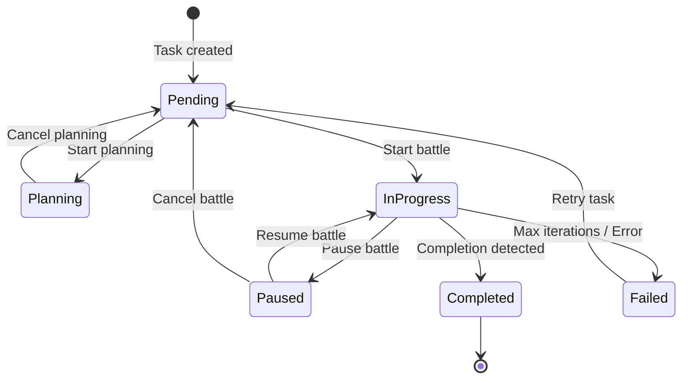
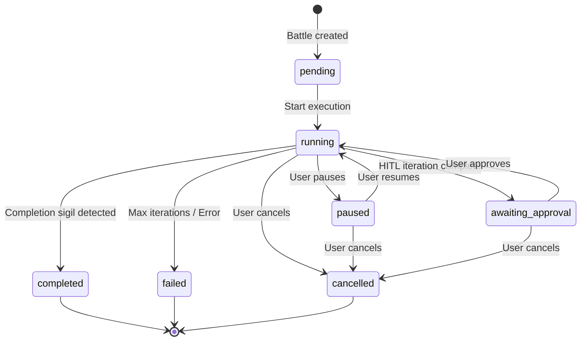
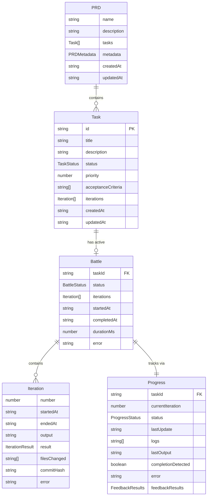

# 01 - Data Model Specification

## Purpose

This specification defines all domain entities, their relationships, validation rules, and persistence mechanisms in PokéRalph. Understanding the data model is foundational to understanding all other features.

## User Stories

### US-DM-1: Data Persistence
**As a** developer
**I want** my PRD, tasks, and battle history to persist across sessions
**So that** I can close the app and resume work later

**Acceptance Criteria:**
- PRD and config are saved to `.pokeralph/` folder
- Battle history is saved per-task in `battles/{task-id}/`
- Progress is tracked in real-time during battles
- Data survives app restarts

### US-DM-2: Multi-Repository Support
**As a** developer working on multiple projects
**I want** each project to have its own `.pokeralph/` folder
**So that** project data doesn't conflict

**Acceptance Criteria:**
- Each repository has independent `.pokeralph/` folder
- Switching repositories loads correct data
- No cross-contamination between projects

## Current Behavior

The data model consists of these core entities persisted in the `.pokeralph/` folder:

```
.pokeralph/
├── config.json              # Project configuration
├── prd.json                 # PRD with embedded tasks
└── battles/
    └── {task-id}/
        ├── progress.json    # Real-time progress (polled)
        ├── history.json     # Completed iterations
        └── logs/
            └── iteration-{n}.log
```

## Entity Definitions

### Config

Configuration that controls battle execution behavior.

```typescript
interface Config {
  maxIterationsPerTask: number;  // Default: 10
  mode: ExecutionMode;           // "hitl" | "yolo"
  feedbackLoops: string[];       // ["test", "lint", "typecheck"]
  timeoutMinutes: number;        // Default: 30
  pollingIntervalMs: number;     // Default: 2000
  autoCommit: boolean;           // Default: true
}

type ExecutionMode = "hitl" | "yolo";
```

**Field Validation:**
| Field | Type | Required | Constraints |
|-------|------|----------|-------------|
| `maxIterationsPerTask` | number | yes | > 0, <= 100 |
| `mode` | string | yes | "hitl" or "yolo" |
| `feedbackLoops` | string[] | yes | Non-empty array |
| `timeoutMinutes` | number | yes | > 0, <= 60 |
| `pollingIntervalMs` | number | yes | >= 500, <= 10000 |
| `autoCommit` | boolean | yes | - |

**Default Values:**
```typescript
const DEFAULT_CONFIG: Config = {
  maxIterationsPerTask: 10,
  mode: "hitl",
  feedbackLoops: ["test", "lint", "typecheck"],
  timeoutMinutes: 30,
  pollingIntervalMs: 2000,
  autoCommit: true,
};
```

---

### PRD (Product Requirements Document)

Container for project definition and all tasks.

```typescript
interface PRD {
  name: string;                  // Project name
  description: string;           // Project description
  tasks: Task[];                 // Array of tasks
  metadata?: PRDMetadata;        // Optional metadata
  createdAt: string;             // ISO timestamp
  updatedAt?: string;            // ISO timestamp
}

interface PRDMetadata {
  version: string;               // Schema version (e.g., "1.0.0")
  generatedBy?: string;          // Tool that generated PRD
  originalIdea?: string;         // Original user idea
}
```

**Field Validation:**
| Field | Type | Required | Constraints |
|-------|------|----------|-------------|
| `name` | string | yes | Non-empty, max 200 chars |
| `description` | string | yes | Non-empty |
| `tasks` | Task[] | yes | Array (can be empty initially) |
| `metadata.version` | string | no | Semver format |
| `createdAt` | string | yes | ISO 8601 format |
| `updatedAt` | string | no | ISO 8601 format |

---

### Task

A unit of work to be executed as a "battle".

```typescript
interface Task {
  id: string;                    // e.g., "001-monorepo-setup"
  title: string;                 // Human-readable title
  description: string;           // Detailed description
  status: TaskStatus;            // Current status
  priority: number;              // Lower = higher priority
  acceptanceCriteria: string[];  // Completion criteria
  iterations: Iteration[];       // Runtime data (empty in PRD)
  createdAt: string;             // ISO timestamp
  updatedAt: string;             // ISO timestamp
}

enum TaskStatus {
  Pending = "pending",
  Planning = "planning",
  InProgress = "in_progress",
  Paused = "paused",
  Completed = "completed",
  Failed = "failed",
}
```

**Task ID Format:**
- Pattern: `{NNN}-{slug}`
- Example: `001-monorepo-setup`
- NNN is zero-padded (001, 002, ...)
- Slug is derived from title (lowercase, hyphens, max 30 chars)

**Field Validation:**
| Field | Type | Required | Constraints |
|-------|------|----------|-------------|
| `id` | string | yes | Match pattern `\d{3}-[a-z0-9-]+` |
| `title` | string | yes | Non-empty, max 200 chars |
| `description` | string | yes | Non-empty |
| `status` | TaskStatus | yes | Valid enum value |
| `priority` | number | yes | >= 1 |
| `acceptanceCriteria` | string[] | yes | Non-empty array |
| `iterations` | Iteration[] | yes | Array (empty in PRD) |
| `createdAt` | string | yes | ISO 8601 format |
| `updatedAt` | string | yes | ISO 8601 format |

**Status Transitions:**


---

### Battle

Execution record for a single task through the Battle Loop.

```typescript
interface Battle {
  taskId: string;                // Reference to task
  status: BattleStatus;          // Current battle status
  iterations: Iteration[];       // Completed iterations
  startedAt: string;             // ISO timestamp
  completedAt?: string;          // ISO timestamp (when finished)
  durationMs?: number;           // Total duration
  error?: string;                // Error message if failed
}

type BattleStatus =
  | "pending"
  | "running"
  | "paused"
  | "awaiting_approval"
  | "completed"
  | "failed"
  | "cancelled";
```

**Persistence:** `battles/{taskId}/history.json`

**Field Validation:**
| Field | Type | Required | Constraints |
|-------|------|----------|-------------|
| `taskId` | string | yes | Must exist in PRD |
| `status` | BattleStatus | yes | Valid enum value |
| `iterations` | Iteration[] | yes | Array |
| `startedAt` | string | yes | ISO 8601 format |
| `completedAt` | string | no | ISO 8601 format |
| `durationMs` | number | no | >= 0 |
| `error` | string | no | Present if status is "failed" |

**Status Transitions:**


---

### Iteration

A single Claude Code execution within a battle.

```typescript
interface Iteration {
  number: number;                // 1-indexed iteration number
  startedAt: string;             // ISO timestamp
  endedAt?: string;              // ISO timestamp
  output: string;                // Claude's output summary
  result: IterationResult;       // Result of iteration
  filesChanged: string[];        // Modified files
  commitHash?: string;           // Git commit if auto-commit
  error?: string;                // Error message if failed
}

type IterationResult = "success" | "failure" | "timeout" | "cancelled";
```

**Field Validation:**
| Field | Type | Required | Constraints |
|-------|------|----------|-------------|
| `number` | number | yes | >= 1 |
| `startedAt` | string | yes | ISO 8601 format |
| `endedAt` | string | no | ISO 8601 format |
| `output` | string | yes | May be empty |
| `result` | IterationResult | yes | Valid enum value |
| `filesChanged` | string[] | yes | Array of relative paths |
| `commitHash` | string | no | Git SHA format |
| `error` | string | no | Present if result is "failure" |

---

### Progress

Real-time progress tracking during battle execution.

```typescript
interface Progress {
  taskId: string;                // Reference to task
  currentIteration: number;      // Current iteration (1-indexed)
  status: ProgressStatus;        // Current progress status
  lastUpdate: string;            // ISO timestamp
  logs: string[];                // Log messages from Claude
  lastOutput: string;            // Most recent output line
  completionDetected: boolean;   // True if sigil found
  error: string | null;          // Error message or null
  feedbackResults: FeedbackResults;  // Feedback loop results
}

type ProgressStatus =
  | "idle"
  | "in_progress"
  | "awaiting_approval"
  | "completed"
  | "failed";

interface FeedbackResult {
  passed: boolean;               // Did the loop pass?
  output: string;                // Command output
  duration?: number;             // Duration in ms
}

type FeedbackResults = Record<string, FeedbackResult>;
```

**Persistence:** `battles/{taskId}/progress.json`

**Field Validation:**
| Field | Type | Required | Constraints |
|-------|------|----------|-------------|
| `taskId` | string | yes | Must exist in PRD |
| `currentIteration` | number | yes | >= 0 |
| `status` | ProgressStatus | yes | Valid enum value |
| `lastUpdate` | string | yes | ISO 8601 format |
| `logs` | string[] | yes | Array |
| `lastOutput` | string | yes | May be empty |
| `completionDetected` | boolean | yes | - |
| `error` | string \| null | yes | - |
| `feedbackResults` | object | yes | Keys are feedback loop names |

---

## Entity Relationships



---

## Persistence Layer

### FileManager Service

The `FileManager` service handles all file I/O operations.

**File Paths:**
| Data | Path |
|------|------|
| Config | `.pokeralph/config.json` |
| PRD | `.pokeralph/prd.json` |
| Battle History | `.pokeralph/battles/{taskId}/history.json` |
| Progress | `.pokeralph/battles/{taskId}/progress.json` |
| Iteration Log | `.pokeralph/battles/{taskId}/logs/iteration-{n}.log` |

**Operations:**
```typescript
class FileManager {
  // Initialization
  async init(): Promise<void>;
  async exists(): Promise<boolean>;

  // Config
  async loadConfig(): Promise<Config>;
  async saveConfig(config: Config): Promise<void>;

  // PRD
  async loadPRD(): Promise<PRD>;
  async savePRD(prd: PRD): Promise<void>;

  // Battle
  async createBattleFolder(taskId: string): Promise<void>;
  async loadBattleHistory(taskId: string): Promise<Battle>;
  async saveBattleHistory(taskId: string, battle: Battle): Promise<void>;

  // Progress
  async loadProgress(taskId: string): Promise<Progress>;
  async saveProgress(taskId: string, progress: Progress): Promise<void>;

  // Logs
  async writeIterationLog(taskId: string, iteration: number, content: string): Promise<void>;
  async readIterationLog(taskId: string, iteration: number): Promise<string>;
}
```

---

## Error Handling

### File Read Errors

| Error | Cause | Recovery |
|-------|-------|----------|
| `ENOENT` | File doesn't exist | Return null or create default |
| `EACCES` | Permission denied | Throw error to user |
| `JSON parse error` | Corrupt file | Log error, throw to user |

### File Write Errors

| Error | Cause | Recovery |
|-------|-------|----------|
| `ENOENT` | Parent directory missing | Create directory first |
| `EACCES` | Permission denied | Throw error to user |
| `ENOSPC` | Disk full | Throw error to user |

### Data Validation Errors

| Error | Cause | Recovery |
|-------|-------|----------|
| Missing required field | Invalid data | Throw validation error |
| Invalid enum value | Invalid data | Throw validation error |
| Invalid timestamp | Malformed date | Use current timestamp |

---

## Edge Cases

### Status Overlap Issue

**Problem:** Three status types have overlapping meanings:
- `TaskStatus`: pending, planning, in_progress, paused, completed, failed
- `BattleStatus`: pending, running, paused, awaiting_approval, completed, failed, cancelled
- `ProgressStatus`: idle, in_progress, awaiting_approval, completed, failed

**Current Behavior:**
- TaskStatus is updated based on battle events
- BattleStatus tracks the battle execution state
- ProgressStatus tracks real-time progress within an iteration

**Proposed Improvement:**
Define clear mappings between statuses:
```typescript
const BATTLE_TO_TASK_STATUS: Record<BattleStatus, TaskStatus> = {
  "pending": TaskStatus.Pending,
  "running": TaskStatus.InProgress,
  "paused": TaskStatus.Paused,
  "awaiting_approval": TaskStatus.InProgress,
  "completed": TaskStatus.Completed,
  "failed": TaskStatus.Failed,
  "cancelled": TaskStatus.Paused,
};
```

### Concurrent Access

**Problem:** Multiple clients could write to same file simultaneously.

**Current Behavior:** No locking mechanism. Last write wins.

**Proposed Improvement:**
- Implement file-level locking using `flock` or similar
- Use optimistic concurrency with version numbers
- Add `version` field to all persisted entities

### Partial File Writes

**Problem:** Power failure or crash during write could corrupt files.

**Current Behavior:** Direct file writes without atomic operations.

**Proposed Improvement:**
- Write to temp file first, then rename (atomic on most filesystems)
- Keep backup of previous version
- Add checksum for integrity verification

---

## Testing Requirements

### Unit Tests
- [ ] Config validation rejects invalid values
- [ ] Task ID generation follows pattern
- [ ] Status transitions are enforced
- [ ] Timestamp formats are valid ISO 8601
- [ ] FileManager creates directory structure

### Integration Tests
- [ ] PRD round-trips through save/load
- [ ] Battle history accumulates iterations
- [ ] Progress updates don't lose data
- [ ] Concurrent saves don't corrupt data

### E2E Tests
- [ ] Create PRD, add task, run battle, complete task
- [ ] Switch repositories preserves data
- [ ] App restart recovers state

---

## Performance Considerations

### File Size Growth
- Battle history grows with each iteration
- Progress file is rewritten every update (2s interval)
- Iteration logs accumulate over time

**Mitigation:**
- Archive old battle history after completion
- Limit log retention (e.g., keep last 10 iterations)
- Compress old logs

### Polling Overhead
- Progress file polled every 2 seconds
- Each poll reads entire file
- Multiple clients multiply reads

**Mitigation:**
- Use file modification time to skip unchanged reads
- Increase poll interval for completed battles
- Consider WebSocket-based progress updates

---

## Open Questions

1. **Should we support multiple active battles?** Currently only one battle can run at a time.
2. **Should tasks be editable during battle?** Currently tasks are immutable during execution.
3. **How long should battle history be retained?** No current cleanup policy.
4. **Should we encrypt sensitive data?** PRD may contain business logic.
