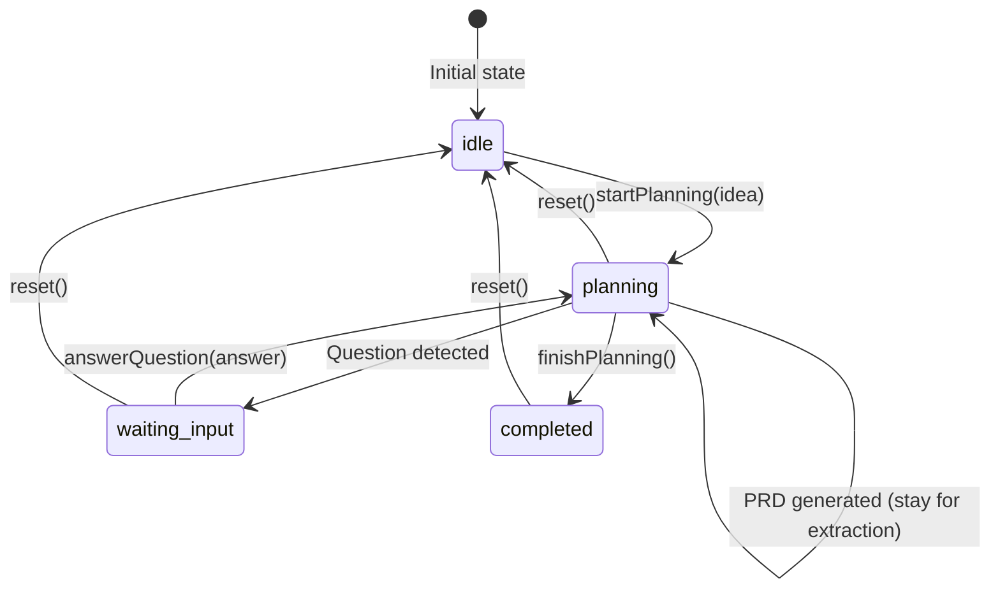
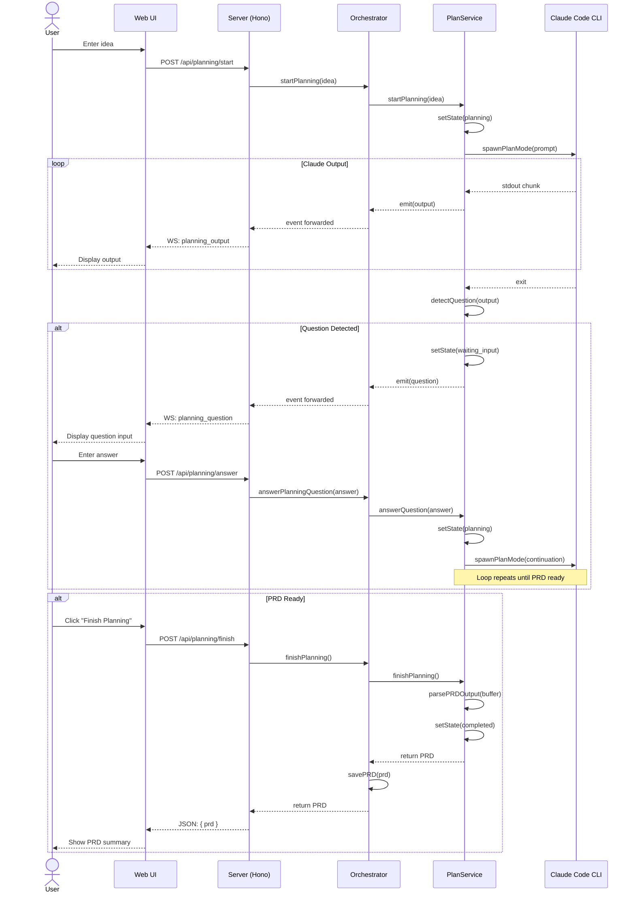
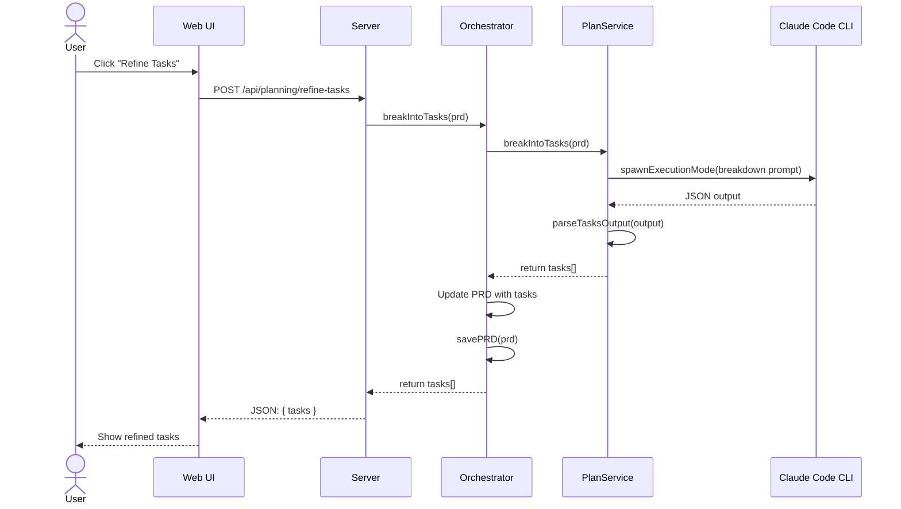

# 02 - Planning Phase Specification

## Purpose

The planning phase is an interactive workflow where users describe an idea and Claude helps refine it into a structured PRD with tasks. This is the entry point for creating new project work in PokéRalph.

## User Stories

### US-PL-1: Initial Idea Input
**As a** developer
**I want** to describe my project idea in natural language
**So that** I can quickly get started without formal documentation

**Acceptance Criteria:**
- Free-text input field for idea
- Minimum 10 characters, maximum 10,000 characters
- Submit starts planning session

### US-PL-2: Interactive Q&A
**As a** developer
**I want** Claude to ask clarifying questions
**So that** the generated PRD captures my actual requirements

**Acceptance Criteria:**
- Claude asks one or more questions
- UI shows question prominently
- Text input for answers
- Multi-turn conversation supported

### US-PL-3: PRD Generation
**As a** developer
**I want** Claude to generate a structured PRD
**So that** I have a clear project definition with tasks

**Acceptance Criteria:**
- PRD includes name, description, tasks
- Each task has title, description, priority, acceptance criteria
- PRD is saved to `.pokeralph/prd.json`
- User can review before accepting

### US-PL-4: Task Refinement
**As a** developer
**I want** the PRD tasks to be broken into executable units
**So that** each task is small enough for a single battle

**Acceptance Criteria:**
- Tasks are appropriately scoped
- Tasks have clear acceptance criteria
- Task IDs follow naming convention
- Tasks are ordered by priority

## Current Behavior

### State Machine



**States:**
| State | Description |
|-------|-------------|
| `idle` | No planning in progress |
| `planning` | Claude is processing/generating |
| `waiting_input` | Waiting for user answer |
| `completed` | PRD extracted successfully |

### Sequence Diagram: Full Planning Flow



### Sequence Diagram: Task Refinement



## API Specification

### POST /api/planning/start

Start a new planning session.

**Request:**
```typescript
interface StartPlanningRequest {
  idea: string;  // 10-10000 characters
}
```

**Response:**
```typescript
interface StartPlanningResponse {
  success: boolean;
  message: string;
}
```

**Errors:**
| Status | Code | Description |
|--------|------|-------------|
| 400 | `INVALID_IDEA` | Idea too short or too long |
| 409 | `PLANNING_IN_PROGRESS` | Another planning session active |
| 500 | `INTERNAL_ERROR` | Unexpected server error |

**Example:**
```bash
curl -X POST http://localhost:3456/api/planning/start \
  -H "Content-Type: application/json" \
  -d '{"idea": "Build a todo app with React"}'
```

---

### POST /api/planning/answer

Answer a planning question.

**Request:**
```typescript
interface AnswerQuestionRequest {
  answer: string;  // 1-10000 characters
}
```

**Response:**
```typescript
interface AnswerQuestionResponse {
  success: boolean;
  message: string;
}
```

**Errors:**
| Status | Code | Description |
|--------|------|-------------|
| 400 | `NOT_WAITING_FOR_INPUT` | No question pending |
| 400 | `INVALID_ANSWER` | Answer empty or too long |
| 500 | `INTERNAL_ERROR` | Unexpected server error |

---

### POST /api/planning/finish

Finish planning and extract PRD.

**Request:** None (empty body)

**Response:**
```typescript
interface FinishPlanningResponse {
  success: boolean;
  prd: PRD;
}
```

**Errors:**
| Status | Code | Description |
|--------|------|-------------|
| 400 | `NO_PLANNING_SESSION` | No planning session to finish |
| 400 | `PRD_PARSE_FAILED` | Could not extract valid PRD |
| 500 | `INTERNAL_ERROR` | Unexpected server error |

---

### POST /api/planning/refine-tasks

Break PRD into refined tasks using Claude.

**Request:** None (uses current PRD)

**Response:**
```typescript
interface RefineTasksResponse {
  success: boolean;
  tasks: Task[];
}
```

**Errors:**
| Status | Code | Description |
|--------|------|-------------|
| 400 | `NO_PRD` | No PRD exists to refine |
| 500 | `TASK_PARSE_FAILED` | Could not parse tasks |

---

### GET /api/planning/state

Get current planning state.

**Response:**
```typescript
interface PlanningStateResponse {
  state: "idle" | "planning" | "waiting_input" | "completed";
  pendingQuestion: string | null;
  hasOutput: boolean;
}
```

---

### POST /api/planning/reset

Reset planning to idle state.

**Response:**
```typescript
interface ResetResponse {
  success: boolean;
}
```

---

## Event Specification

### planning_output

Emitted when Claude produces output.

```typescript
interface PlanningOutputEvent {
  type: "planning_output";
  payload: {
    output: string;  // Chunk of output text
  };
  timestamp: string;
}
```

**Frequency:** Many times during planning (streamed)

---

### planning_question

Emitted when Claude asks a question.

```typescript
interface PlanningQuestionEvent {
  type: "planning_question";
  payload: {
    question: string;  // Detected question text
  };
  timestamp: string;
}
```

**Frequency:** 0-N times per planning session

---

### planning_completed

Emitted when planning finishes successfully.

```typescript
interface PlanningCompletedEvent {
  type: "planning_completed";
  payload: {
    prd: PRD;
  };
  timestamp: string;
}
```

**Frequency:** Once per successful planning session

---

### planning_keepalive

Emitted periodically during long planning operations.

```typescript
interface PlanningKeepaliveEvent {
  type: "planning_keepalive";
  payload: {
    timestamp: string;
    state: "idle" | "planning" | "waiting_input" | "completed";
  };
  timestamp: string;
}
```

**Frequency:** Every 30 seconds during active planning

---

## UI Requirements

### Planning View Components

```
┌────────────────────────────────────────────────────────┐
│  Planning Phase                               [Reset]  │
├────────────────────────────────────────────────────────┤
│                                                        │
│  ┌──────────────────────────────────────────────────┐ │
│  │ Describe your idea:                              │ │
│  │                                                  │ │
│  │ [                                              ] │ │
│  │ [                                              ] │ │
│  │ [                                              ] │ │
│  │                                                  │ │
│  └──────────────────────────────────────────────────┘ │
│                                         [Start Planning]│
│                                                        │
├─────────────────── OR (during planning) ───────────────┤
│                                                        │
│  ┌──────────────────────────────────────────────────┐ │
│  │ Claude's Output:                       [Scroll]  │ │
│  │ ─────────────────────────────────────────────── │ │
│  │ I'll help you create a PRD for your todo app.   │ │
│  │ Let me understand a few things first:            │ │
│  │                                                  │ │
│  │ 1. What authentication method would you prefer? │ │
│  │ 2. Should tasks support due dates?              │ │
│  │ 3. Do you need categories or tags?              │ │
│  └──────────────────────────────────────────────────┘ │
│                                                        │
│  ┌──────────────────────────────────────────────────┐ │
│  │ Your Answer:                                     │ │
│  │ [                                              ] │ │
│  └──────────────────────────────────────────────────┘ │
│                                         [Send Answer]  │
│                                                        │
├─────────────────── OR (PRD ready) ─────────────────────┤
│                                                        │
│  ┌──────────────────────────────────────────────────┐ │
│  │ Generated PRD:                                   │ │
│  │ ─────────────────────────────────────────────── │ │
│  │ Name: Todo App with Authentication               │ │
│  │ Description: A full-featured todo application... │ │
│  │                                                  │ │
│  │ Tasks (5):                                       │ │
│  │ 1. Set up project structure                     │ │
│  │ 2. Implement authentication                     │ │
│  │ 3. Create task CRUD operations                  │ │
│  │ 4. Add due dates and reminders                  │ │
│  │ 5. Implement categories                         │ │
│  └──────────────────────────────────────────────────┘ │
│                                                        │
│         [Refine Tasks]            [Accept PRD]        │
└────────────────────────────────────────────────────────┘
```

### Component States

| Component | States |
|-----------|--------|
| IdeaInput | `empty`, `typing`, `submitted` |
| OutputDisplay | `hidden`, `streaming`, `complete` |
| QuestionInput | `hidden`, `waiting`, `submitting` |
| PRDPreview | `hidden`, `loading`, `ready` |
| ActionButtons | `start`, `answer`, `finish` |

### Visual Indicators

| Indicator | Meaning |
|-----------|---------|
| Spinner | Claude is processing |
| Pulse animation | Waiting for user input |
| Green checkmark | Step completed |
| Yellow warning | Question needs attention |

---

## Guided Planning Flow (UX Enhancement)

### Stepper UI

The planning process should be visualized as a multi-step wizard:

```
┌────────────────────────────────────────────────────────────────────┐
│  Planning                                                          │
│  ═══════════════════════════════════════════════════════════════  │
│                                                                    │
│  ┌─────────┐    ┌─────────┐    ┌─────────┐    ┌─────────┐    ┌────────┐
│  │ 1. Idea │───▶│ 2. Q&A  │───▶│3. Draft │───▶│4. Review│───▶│5. Ready│
│  │   ✓     │    │   ●     │    │   PRD   │    │  /Edit  │    │        │
│  └─────────┘    └─────────┘    └─────────┘    └─────────┘    └────────┘
│                                                                    │
│  Current Step: Q&A - Answering Claude's questions                 │
│  ─────────────────────────────────────────────────────────────────│
│  ...                                                               │
└────────────────────────────────────────────────────────────────────┘
```

**Step States:**
| Step | State | Visual |
|------|-------|--------|
| 1. Idea | `complete`, `active`, `pending` | ✓, ●, ○ |
| 2. Q&A | `complete`, `active`, `pending` | ✓, ●, ○ |
| 3. Draft PRD | `complete`, `active`, `pending` | ✓, ●, ○ |
| 4. Review/Edit | `complete`, `active`, `pending` | ✓, ●, ○ |
| 5. Tasks Ready | `complete`, `active`, `pending` | ✓, ●, ○ |

**Step Transitions:**
- Step 1 → 2: User submits idea
- Step 2 → 3: Claude generates draft PRD (may loop back for more Q&A)
- Step 3 → 4: PRD extracted successfully
- Step 4 → 5: User accepts PRD (with optional edits)

---

### Auto-Save Draft PRD

**Purpose:** Prevent data loss during long planning sessions.

**Behavior:**
- After each Q&A turn, attempt to extract partial PRD
- Save draft to `.pokeralph/prd.draft.json`
- Show "Draft saved" indicator
- Recover draft on page reload or disconnect

**Draft Schema:**
```typescript
interface DraftPRD {
  idea: string;
  conversation: ConversationTurn[];
  partialPRD?: Partial<PRD>;
  lastSavedAt: string;
  version: number;
}

interface ConversationTurn {
  role: "user" | "assistant";
  content: string;
  timestamp: string;
}
```

**UI Indicator:**
```
┌──────────────────────────────────────┐
│  Draft auto-saved ✓  2 minutes ago   │
└──────────────────────────────────────┘
```

---

### Completeness Checklist

**Purpose:** Show users what's needed for a valid PRD before finishing.

**Checklist Items:**
```
┌──────────────────────────────────────────────────────────────┐
│  PRD Completeness                                             │
│  ─────────────────────────────────────────────────────────── │
│  ✓ Project name defined                                       │
│  ✓ Description provided                                       │
│  ⚠ At least one task (currently: 0)                          │
│  ○ All tasks have acceptance criteria                         │
│  ○ Tasks ordered by priority                                  │
│  ─────────────────────────────────────────────────────────── │
│  Completeness: 40%  [████░░░░░░]                             │
└──────────────────────────────────────────────────────────────┘
```

**Checklist Schema:**
```typescript
interface CompletenessCheck {
  id: string;
  label: string;
  required: boolean;
  check: (prd: Partial<PRD>) => boolean;
  hint?: string;
}

const COMPLETENESS_CHECKS: CompletenessCheck[] = [
  { id: "name", label: "Project name defined", required: true, check: (p) => !!p.name?.trim() },
  { id: "description", label: "Description provided", required: true, check: (p) => !!p.description?.trim() },
  { id: "has_tasks", label: "At least one task", required: true, check: (p) => (p.tasks?.length ?? 0) > 0 },
  { id: "tasks_have_criteria", label: "All tasks have acceptance criteria", required: false,
    check: (p) => p.tasks?.every(t => t.acceptanceCriteria?.length > 0) ?? false },
  { id: "tasks_ordered", label: "Tasks ordered by priority", required: false,
    check: (p) => p.tasks?.every((t, i, arr) => i === 0 || arr[i-1].priority <= t.priority) ?? false },
];
```

---

### Inline Task Editing

**Purpose:** Allow editing tasks before finishing planning without a separate editor.

**UI:**
```
┌──────────────────────────────────────────────────────────────────┐
│  Generated Tasks                                    [+ Add Task]  │
│  ─────────────────────────────────────────────────────────────── │
│                                                                  │
│  ┌────────────────────────────────────────────────────────────┐ │
│  │ ☰ 001-setup-project                         [Edit] [Delete] │ │
│  │   Set up the monorepo with Bun workspaces                   │ │
│  │   Priority: 1 | Criteria: 3                                 │ │
│  └────────────────────────────────────────────────────────────┘ │
│                                                                  │
│  ┌────────────────────────────────────────────────────────────┐ │
│  │ ☰ 002-auth-system                           [Edit] [Delete] │ │
│  │   Implement user authentication with JWT                    │ │
│  │   Priority: 2 | Criteria: 5                                 │ │
│  └────────────────────────────────────────────────────────────┘ │
│                                                                  │
│  ─────────────────────────────────────────────────────────────── │
│  Drag ☰ to reorder | Click Edit to modify | Click Delete to remove│
└──────────────────────────────────────────────────────────────────┘
```

**Edit Modal:**
```
┌────────────────────────────────────────────────────────────────┐
│  Edit Task: 001-setup-project                         [X Close] │
├────────────────────────────────────────────────────────────────┤
│                                                                │
│  Title:                                                        │
│  [Set up the monorepo with Bun workspaces_____________]       │
│                                                                │
│  Description:                                                  │
│  [                                                   ]         │
│  [Create the initial project structure with Bun     ]         │
│  [workspaces for core, server, and web packages.    ]         │
│  [                                                   ]         │
│                                                                │
│  Priority: [1 ▼]                                               │
│                                                                │
│  Acceptance Criteria:                                          │
│  ┌──────────────────────────────────────────────────────────┐ │
│  │ 1. [packages/ folder with core, server, web__________] [×]│ │
│  │ 2. [bun workspaces configured in package.json________] [×]│ │
│  │ 3. [TypeScript configured for all packages___________] [×]│ │
│  └──────────────────────────────────────────────────────────┘ │
│  [+ Add Criterion]                                             │
│                                                                │
├────────────────────────────────────────────────────────────────┤
│                                     [Cancel]    [Save Changes] │
└────────────────────────────────────────────────────────────────┘
```

---

### Templates / Starter Prompts

**Purpose:** Help users get started with common project types.

**Template Selection UI:**
```
┌────────────────────────────────────────────────────────────────────┐
│  Start Planning                                                    │
│  ═══════════════════════════════════════════════════════════════  │
│                                                                    │
│  Choose a template or describe your idea:                         │
│                                                                    │
│  ┌─────────────────┐  ┌─────────────────┐  ┌─────────────────┐   │
│  │  🌐 Web App     │  │  🔌 API/Backend │  │  📱 Mobile App  │   │
│  │                 │  │                 │  │                 │   │
│  │  React, Vue,    │  │  REST API,      │  │  React Native,  │   │
│  │  Next.js, etc.  │  │  GraphQL, etc.  │  │  Expo, etc.     │   │
│  └─────────────────┘  └─────────────────┘  └─────────────────┘   │
│                                                                    │
│  ┌─────────────────┐  ┌─────────────────┐  ┌─────────────────┐   │
│  │  🛠️ CLI Tool    │  │  📦 Library     │  │  🏗️ Infra       │   │
│  │                 │  │                 │  │                 │   │
│  │  Command-line   │  │  npm package,   │  │  Docker, K8s,   │   │
│  │  applications   │  │  SDK, etc.      │  │  Terraform      │   │
│  └─────────────────┘  └─────────────────┘  └─────────────────┘   │
│                                                                    │
│  ─────────────────── OR describe your own ────────────────────    │
│                                                                    │
│  [                                                              ]  │
│  [Describe your project idea here...                           ]  │
│                                                                    │
└────────────────────────────────────────────────────────────────────┘
```

**Template Definitions:**
```typescript
interface PlanningTemplate {
  id: string;
  name: string;
  icon: string;
  description: string;
  starterPrompt: string;
  suggestedQuestions: string[];
  defaultTasks?: Partial<Task>[];
}

const TEMPLATES: PlanningTemplate[] = [
  {
    id: "web-app",
    name: "Web App",
    icon: "🌐",
    description: "React, Vue, Next.js, etc.",
    starterPrompt: "I want to build a web application that...",
    suggestedQuestions: [
      "What framework do you prefer (React, Vue, Svelte)?",
      "Do you need server-side rendering?",
      "What authentication method do you want?",
      "What database will you use?",
    ],
  },
  {
    id: "api-backend",
    name: "API/Backend",
    icon: "🔌",
    description: "REST API, GraphQL, etc.",
    starterPrompt: "I want to build a backend API that...",
    suggestedQuestions: [
      "REST or GraphQL?",
      "What data will the API manage?",
      "What authentication method?",
      "What database?",
    ],
  },
  // ... more templates
];
```

---

### Fallback Human-Editable PRD View

**Purpose:** Allow manual PRD editing when JSON extraction fails.

**Trigger:** When `parsePRDOutput()` fails to extract valid JSON.

**Recovery UI:**
```
┌────────────────────────────────────────────────────────────────────┐
│  ⚠️ PRD Extraction Failed                                         │
│  ═══════════════════════════════════════════════════════════════  │
│                                                                    │
│  Claude's response didn't contain valid PRD JSON. You can:        │
│                                                                    │
│  ┌─────────────────────────────────────────────────────────────┐  │
│  │ Option 1: Continue the conversation                          │  │
│  │ Ask Claude to regenerate the PRD in the correct format.      │  │
│  │                                                 [Continue →]  │  │
│  └─────────────────────────────────────────────────────────────┘  │
│                                                                    │
│  ┌─────────────────────────────────────────────────────────────┐  │
│  │ Option 2: Create PRD manually                                │  │
│  │ Enter the PRD details yourself based on the conversation.    │  │
│  │                                                 [Create PRD]  │  │
│  └─────────────────────────────────────────────────────────────┘  │
│                                                                    │
│  ─────────────────────────────────────────────────────────────────│
│                                                                    │
│  Claude's raw output (for reference):                             │
│  ┌─────────────────────────────────────────────────────────────┐  │
│  │ Based on our conversation, here's the project plan:          │  │
│  │                                                               │  │
│  │ Project: Todo App                                             │  │
│  │ - Set up React project with TypeScript                       │  │
│  │ - Implement task CRUD operations                             │  │
│  │ - Add user authentication                                     │  │
│  │ ...                                                           │  │
│  └─────────────────────────────────────────────────────────────┘  │
│                                                                    │
└────────────────────────────────────────────────────────────────────┘
```

**Manual PRD Form:**
```
┌────────────────────────────────────────────────────────────────────┐
│  Create PRD Manually                                     [X Close] │
├────────────────────────────────────────────────────────────────────┤
│                                                                    │
│  Project Name: [Todo App_______________________________________]  │
│                                                                    │
│  Description:                                                      │
│  [                                                              ]  │
│  [A full-featured todo application with user authentication    ]  │
│  [and task management capabilities.                            ]  │
│  [                                                              ]  │
│                                                                    │
│  ────────────────────────────────────────────────────────────────  │
│                                                                    │
│  Tasks:                                                            │
│                                                                    │
│  ┌──────────────────────────────────────────────────────────────┐ │
│  │ Task 1:                                                       │ │
│  │ Title: [Set up React project with TypeScript_______________] │ │
│  │ Description: [Create initial project structure____________]  │ │
│  │ Priority: [1]  Acceptance Criteria: [+ Add]                  │ │
│  └──────────────────────────────────────────────────────────────┘ │
│                                                                    │
│  [+ Add Another Task]                                              │
│                                                                    │
├────────────────────────────────────────────────────────────────────┤
│                                             [Cancel]    [Save PRD] │
└────────────────────────────────────────────────────────────────────┘
```

**Fallback Logic:**
```typescript
async function handlePRDExtractionFailure(rawOutput: string): Promise<PRD | null> {
  // 1. Try multiple extraction strategies
  const strategies = [
    extractFromCodeBlock,      // Look for ```json blocks
    extractFromMarkers,        // Look for PRD: or similar markers
    extractLooseJSON,          // Try to find any JSON object
    extractFromMarkdown,       // Parse markdown structure
  ];

  for (const strategy of strategies) {
    const result = await strategy(rawOutput);
    if (result) return result;
  }

  // 2. If all fail, show manual entry UI
  return null;
}
```

---

## Error Handling

### Planning Session Errors

| Error | Cause | User Message | Recovery |
|-------|-------|--------------|----------|
| Already planning | Concurrent start | "Planning already in progress" | Use reset button |
| Claude timeout | Long response | "Claude took too long" | Retry or reset |
| Claude crash | Process died | "Claude encountered an error" | Reset and retry |
| Invalid idea | Too short/long | "Please provide more detail" | Edit and resubmit |

### PRD Parse Errors

| Error | Cause | User Message | Recovery |
|-------|-------|--------------|----------|
| No JSON found | Claude didn't output JSON | "Couldn't extract PRD" | Continue conversation |
| Missing name | Invalid structure | "PRD missing required fields" | Continue conversation |
| Missing tasks | No tasks array | "PRD must have at least one task" | Continue conversation |
| Invalid task | Task missing fields | "Task N is incomplete" | Continue conversation |

### Network Errors

| Error | Cause | User Message | Recovery |
|-------|-------|--------------|----------|
| WebSocket disconnect | Connection lost | "Connection lost, reconnecting..." | Auto-reconnect |
| HTTP timeout | Server unresponsive | "Server not responding" | Retry button |
| 500 error | Server crash | "Something went wrong" | Check server logs |

---

## Edge Cases

### Race Condition: State Transition

**Problem:** User answers question while state is still transitioning.

**Current Behavior:**
```typescript
// In answerQuestion():
if (this.state !== "waiting_input" && !this.pendingQuestion) {
  throw new Error(`Not waiting for input. Current state: ${this.state}`);
}
```
The check allows answering if `pendingQuestion` is set even if state hasn't transitioned.

**Proposed Improvement:**
- Add mutex/lock around state transitions
- Queue answers if state is transitioning
- Emit state_change events synchronously

---

### Malformed JSON Recovery

**Problem:** Claude outputs invalid JSON, planning fails silently.

**Current Behavior:**
- `parsePRDOutput()` returns `{ success: false, error: "..." }`
- User sees generic error

**Proposed Improvement:**
- Show partial PRD if possible
- Offer "Continue conversation" option
- Log raw output for debugging
- Auto-prompt Claude to fix format

---

### Long-Running Planning

**Problem:** Planning can take minutes, WebSocket may disconnect.

**Current Behavior:**
- Keepalive events every 30 seconds
- WebSocket timeout at 600 seconds
- No progress indication to user

**Proposed Improvement:**
- Show activity indicator during processing
- Display estimated progress
- Auto-save partial output
- Resume capability after disconnect

---

### Concurrent Planning Attempts

**Problem:** Multiple clients could start planning simultaneously.

**Current Behavior:**
- First request wins
- Subsequent requests get error

**Proposed Improvement:**
- Broadcast planning state to all clients
- Show "Planning in progress" on all clients
- Allow observing (read-only) from other clients

---

## Prompt Templates

### Initial Planning Prompt

```typescript
const PLANNING_PROMPT = `You are helping a user define a software project.

The user has described their idea:
"""
${idea}
"""

Your task:
1. Ask 2-5 clarifying questions to understand the requirements
2. Once you have enough information, generate a PRD in JSON format

PRD JSON Schema:
\`\`\`json
{
  "name": "string - project name",
  "description": "string - detailed description",
  "tasks": [
    {
      "id": "string - format: NNN-slug (e.g., 001-setup-project)",
      "title": "string - short title",
      "description": "string - detailed description",
      "priority": "number - 1 is highest",
      "acceptanceCriteria": ["string - completion criteria"]
    }
  ],
  "metadata": {
    "version": "0.1.0",
    "generatedBy": "PokéRalph PlanService"
  }
}
\`\`\`

IMPORTANT:
- Ask questions FIRST before generating the PRD
- Each task should be completable in 1-3 iterations
- Tasks should be ordered by dependency and priority
- Include clear acceptance criteria for each task`;
```

### Continuation Prompt

```typescript
const CONTINUATION_PROMPT = `Continue the planning conversation.

Previous conversation:
${conversationBuffer}

User's answer: ${answer}

If you have enough information, generate the PRD in JSON format.
Otherwise, ask more clarifying questions.`;
```

### Task Breakdown Prompt

```typescript
const BREAKDOWN_PROMPT = `Break down this PRD into refined, executable tasks.

PRD:
${JSON.stringify(prd, null, 2)}

Requirements:
- Each task should be completable in 1-3 Claude iterations
- Include clear acceptance criteria
- Order by dependency and priority
- Use format: NNN-slug for task IDs

Output as JSON array of tasks.`;
```

---

## Testing Requirements

### Unit Tests
- [ ] State transitions follow state machine
- [ ] Question detection patterns work correctly
- [ ] JSON extraction handles code blocks
- [ ] PRD validation catches all required fields
- [ ] Task validation catches all required fields

### Integration Tests
- [ ] Full planning flow produces valid PRD
- [ ] Multi-turn conversation preserves context
- [ ] Keepalive events emit during long operations
- [ ] Reset clears all state

### E2E Tests
- [ ] User can complete planning in UI
- [ ] Question appears and accepts answer
- [ ] PRD displays correctly after generation
- [ ] Task refinement updates PRD

---

## Performance Considerations

### Claude Execution Time
- Initial planning: 30-120 seconds
- Follow-up questions: 15-60 seconds
- Task breakdown: 15-45 seconds

**Mitigation:**
- Show progress indicator
- Stream output in real-time
- Implement timeout with user notification

### Memory Usage
- Conversation buffer grows with each turn
- Output buffer can be large

**Mitigation:**
- Limit conversation history
- Truncate very long outputs
- Clear buffers on reset

---

## Open Questions

1. **Should planning support file context?** Could attach existing files for Claude to consider.
2. **Should PRD be editable after generation?** Currently read-only until next planning session.
3. **Should we support PRD import?** User might have existing PRD from another tool.
4. **How to handle Claude API rate limits?** Currently no retry logic for rate limit errors.
