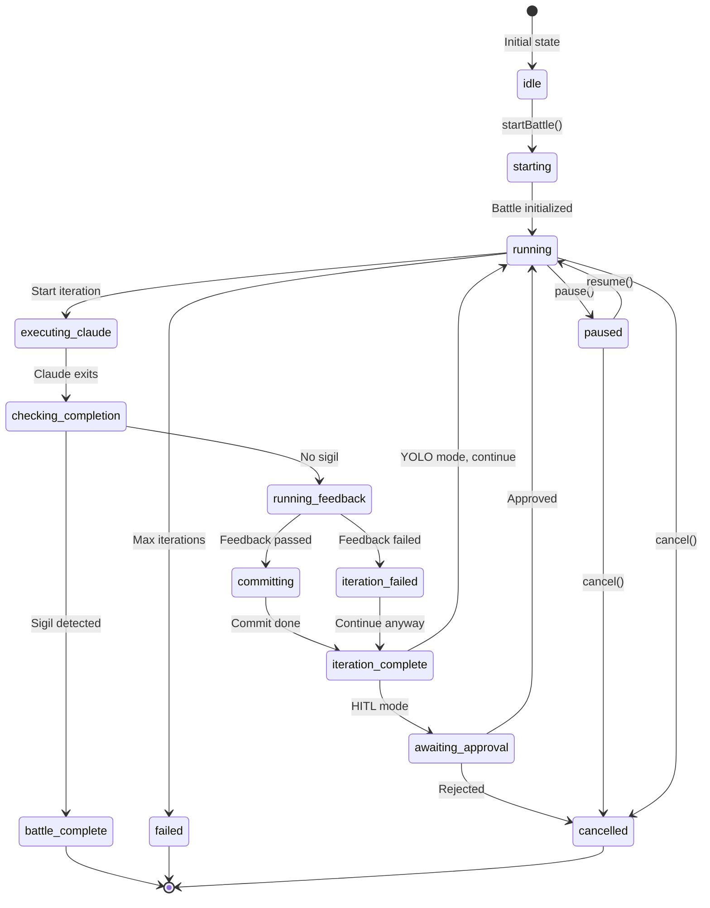
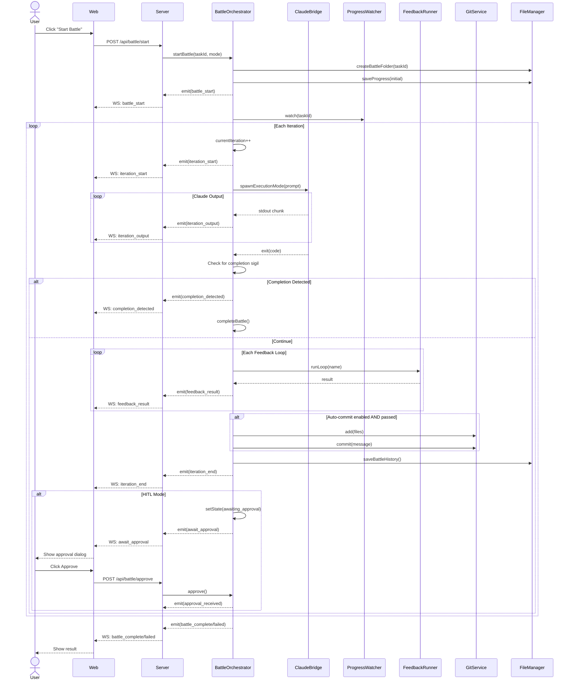

# 03 - Battle Loop Specification

## Purpose

The Battle Loop is the core execution engine of PokéRalph. It autonomously executes tasks by running Claude Code in iterations, monitoring progress, running feedback loops, and committing changes. This is where the "Ralph technique" is implemented.

## User Stories

### US-BT-1: Start Battle
**As a** developer
**I want** to start a battle for a specific task
**So that** Claude can autonomously work on it

**Acceptance Criteria:**
- Select task from dashboard
- Choose execution mode (HITL/YOLO)
- Battle starts and progress is visible
- Only one battle at a time

### US-BT-2: Monitor Progress
**As a** developer
**I want** to see real-time progress during battle
**So that** I know what Claude is doing

**Acceptance Criteria:**
- Live output streaming
- Iteration count visible
- Feedback loop results shown
- Completion detection indicated

### US-BT-3: HITL Approval
**As a** developer using HITL mode
**I want** to review each iteration before continuing
**So that** I can catch issues early

**Acceptance Criteria:**
- Pause after each iteration
- Show iteration summary
- Approve or reject buttons
- Can cancel at any time

### US-BT-4: YOLO Execution
**As a** developer using YOLO mode
**I want** battles to run automatically
**So that** I can work on other things

**Acceptance Criteria:**
- No manual intervention required
- Runs until completion or max iterations
- Auto-commits on success
- Notifies on completion/failure

### US-BT-5: Pause/Resume
**As a** developer
**I want** to pause and resume battles
**So that** I can handle interruptions

**Acceptance Criteria:**
- Pause preserves state
- Resume continues from last point
- Can pause indefinitely

## Current Behavior

### Battle Loop Algorithm

```
START BATTLE(taskId, mode)
  Load config, PRD, task
  Create battle folder
  Initialize battle state

  WHILE iteration < maxIterations AND NOT completed AND NOT cancelled:
    iteration++

    1. BUILD PROMPT
       - Include task context
       - Include PRD summary
       - Include current progress
       - Include feedback loop config

    2. EXECUTE CLAUDE
       - Spawn claude CLI with prompt
       - Capture stdout/stderr
       - Wait for exit

    3. CHECK COMPLETION
       - Look for <promise>COMPLETE</promise> sigil
       - If found, mark battle complete

    4. RUN FEEDBACK LOOPS
       - For each loop in config.feedbackLoops:
         - Run command (test, lint, typecheck)
         - Record pass/fail

    5. GIT COMMIT (if autoCommit AND feedback passed)
       - Stage changed files
       - Commit with task reference

    6. HITL CHECK (if mode == hitl)
       - Pause and wait for approval
       - If rejected, handle accordingly

    7. SAVE PROGRESS
       - Update progress.json
       - Update history.json
       - Write iteration log

  END WHILE

  IF completed: Mark task as completed
  ELSE: Mark task as failed

END BATTLE
```

### State Machine



### Sequence Diagram: Complete Battle Flow



## API Specification

### POST /api/battle/start

Start a battle for a task.

**IMPORTANT: Preflight Enforcement**

Battles cannot be started without passing preflight checks first. This prevents:
- Running commands that don't exist (feedback loop failures)
- Starting battles when another is already running
- Operating on completed or invalid tasks
- Missing configuration or environment issues

The server enforces this by requiring either:
1. A recent passing preflight token (within 5 minutes)
2. Explicit `skipPreflight: true` flag (requires `canStart: true` from last preflight)

**Request:**
```typescript
interface StartBattleRequest {
  taskId: string;
  mode?: "hitl" | "yolo";  // Default: from config

  // Preflight enforcement
  preflightToken?: string;    // Token from recent passing preflight
  skipPreflight?: boolean;    // Skip if last preflight passed (still validated server-side)
}
```

**Response:**
```typescript
interface StartBattleResponse {
  success: boolean;
  message: string;
}
```

**Errors:**
| Status | Code | Description |
|--------|------|-------------|
| 400 | `TASK_NOT_FOUND` | Task doesn't exist |
| 400 | `PREFLIGHT_REQUIRED` | Preflight not run or failed |
| 400 | `PREFLIGHT_EXPIRED` | Preflight token expired (>5 min) |
| 400 | `PREFLIGHT_FAILED` | Preflight had blocking errors |
| 409 | `BATTLE_IN_PROGRESS` | Another battle running |
| 500 | `INTERNAL_ERROR` | Unexpected error |

**Preflight Enforcement Logic:**

```typescript
async function validatePreflightForBattleStart(
  taskId: string,
  request: StartBattleRequest
): Promise<void> {
  // 1. Check if preflight token provided
  if (request.preflightToken) {
    const preflight = await getPreflightByToken(request.preflightToken);

    if (!preflight) {
      throw new ApiError(400, "PREFLIGHT_REQUIRED", "Invalid preflight token");
    }

    if (preflight.taskId !== taskId) {
      throw new ApiError(400, "PREFLIGHT_REQUIRED", "Preflight token is for a different task");
    }

    // Check token age (max 5 minutes)
    const ageMs = Date.now() - new Date(preflight.timestamp).getTime();
    if (ageMs > 5 * 60 * 1000) {
      throw new ApiError(400, "PREFLIGHT_EXPIRED", "Preflight expired, please run again");
    }

    if (!preflight.canStart) {
      throw new ApiError(400, "PREFLIGHT_FAILED", "Preflight had blocking errors");
    }

    return; // Preflight valid
  }

  // 2. Check if skipPreflight requested
  if (request.skipPreflight) {
    // Still validate that last preflight passed
    const lastPreflight = await getLastPreflightForTask(taskId);

    if (!lastPreflight) {
      throw new ApiError(400, "PREFLIGHT_REQUIRED", "No preflight run for this task");
    }

    if (!lastPreflight.canStart) {
      throw new ApiError(400, "PREFLIGHT_FAILED", "Last preflight had blocking errors");
    }

    // Allow skip if last preflight was recent and passed
    const ageMs = Date.now() - new Date(lastPreflight.timestamp).getTime();
    if (ageMs > 10 * 60 * 1000) {  // 10 minute grace period for skip
      throw new ApiError(400, "PREFLIGHT_EXPIRED", "Preflight too old, please run again");
    }

    return; // Skip allowed
  }

  // 3. Neither token nor skip - require preflight
  throw new ApiError(400, "PREFLIGHT_REQUIRED", "Run preflight before starting battle");
}
```

---

### POST /api/battle/pause

Pause the current battle.

**Request:** None

**Response:**
```typescript
interface PauseResponse {
  success: boolean;
}
```

**Errors:**
| Status | Code | Description |
|--------|------|-------------|
| 400 | `NO_BATTLE_RUNNING` | No battle to pause |

---

### POST /api/battle/resume

Resume a paused battle.

**Request:** None

**Response:**
```typescript
interface ResumeResponse {
  success: boolean;
}
```

**Errors:**
| Status | Code | Description |
|--------|------|-------------|
| 400 | `NO_BATTLE_PAUSED` | No paused battle |

---

### POST /api/battle/cancel

Cancel the current battle.

**Request:**
```typescript
interface CancelRequest {
  reason?: string;
}
```

**Response:**
```typescript
interface CancelResponse {
  success: boolean;
}
```

---

### POST /api/battle/approve

Approve current iteration (HITL mode).

**Request:** None

**Response:**
```typescript
interface ApproveResponse {
  success: boolean;
}
```

**Errors:**
| Status | Code | Description |
|--------|------|-------------|
| 400 | `NOT_AWAITING_APPROVAL` | Not waiting for approval |

---

### GET /api/battle/state

Get current battle state.

**Response:**
```typescript
interface BattleStateResponse {
  running: boolean;
  paused: boolean;
  awaitingApproval: boolean;
  state: {
    taskId: string;
    iteration: number;
    status: BattleStatus;
    mode: ExecutionMode;
  } | null;
}
```

---

### GET /api/battle/{taskId}/progress

Get current progress for a task.

**Response:**
```typescript
interface ProgressResponse {
  progress: Progress | null;
}
```

---

### GET /api/battle/{taskId}/history

Get battle history for a task.

**Response:**
```typescript
interface HistoryResponse {
  battle: Battle | null;
}
```

---

## Event Specification

### battle_start

Emitted when a battle begins.

```typescript
interface BattleStartEvent {
  type: "battle_start";
  payload: {
    taskId: string;
    task: Task;
  };
  timestamp: string;
}
```

---

### iteration_start

Emitted when an iteration begins.

```typescript
interface IterationStartEvent {
  type: "iteration_start";
  payload: {
    taskId: string;
    iteration: number;
  };
  timestamp: string;
}
```

---

### iteration_output

Emitted during Claude execution with output chunks.

```typescript
interface IterationOutputEvent {
  type: "iteration_output";
  payload: {
    taskId: string;
    iteration: number;
    output: string;  // Chunk of output
  };
  timestamp: string;
}
```

**Frequency:** Many times per iteration (streamed)

---

### iteration_end

Emitted when an iteration completes.

```typescript
interface IterationEndEvent {
  type: "iteration_end";
  payload: {
    taskId: string;
    iteration: number;
    result: "success" | "failure" | "timeout" | "cancelled";
  };
  timestamp: string;
}
```

---

### progress_update

Emitted when progress changes (from polling).

```typescript
interface ProgressUpdateEvent {
  type: "progress_update";
  payload: {
    taskId: string;
    progress: Progress;
  };
  timestamp: string;
}
```

**Frequency:** Every 2 seconds (polling interval)

---

### completion_detected

Emitted when completion sigil is found.

```typescript
interface CompletionDetectedEvent {
  type: "completion_detected";
  payload: {
    taskId: string;
  };
  timestamp: string;
}
```

---

### feedback_result

Emitted after each feedback loop runs.

```typescript
interface FeedbackResultEvent {
  type: "feedback_result";
  payload: {
    taskId: string;
    loop: string;       // "test", "lint", etc.
    result: {
      passed: boolean;
      output: string;
      duration: number;
    };
  };
  timestamp: string;
}
```

---

### await_approval

Emitted when HITL mode waits for approval.

```typescript
interface AwaitApprovalEvent {
  type: "await_approval";
  payload: {
    taskId: string;
    iteration: number;
    summary: string;    // Truncated output summary
  };
  timestamp: string;
}
```

---

### approval_received

Emitted when approval is given.

```typescript
interface ApprovalReceivedEvent {
  type: "approval_received";
  payload: {
    taskId: string;
    approved: boolean;
  };
  timestamp: string;
}
```

---

### battle_pause

Emitted when battle is paused.

```typescript
interface BattlePauseEvent {
  type: "battle_pause";
  payload: {
    taskId: string;
    iteration: number;
  };
  timestamp: string;
}
```

---

### battle_resume

Emitted when battle is resumed.

```typescript
interface BattleResumeEvent {
  type: "battle_resume";
  payload: {
    taskId: string;
  };
  timestamp: string;
}
```

---

### battle_cancel

Emitted when battle is cancelled.

```typescript
interface BattleCancelEvent {
  type: "battle_cancel";
  payload: {
    taskId: string;
    reason?: string;
  };
  timestamp: string;
}
```

---

### battle_complete

Emitted when battle completes successfully.

```typescript
interface BattleCompleteEvent {
  type: "battle_complete";
  payload: {
    taskId: string;
    battle: Battle;
  };
  timestamp: string;
}
```

---

### battle_failed

Emitted when battle fails.

```typescript
interface BattleFailedEvent {
  type: "battle_failed";
  payload: {
    taskId: string;
    error: string;
    battle: Battle;
  };
  timestamp: string;
}
```

---

## UI Requirements

### Battle View Components

```
┌────────────────────────────────────────────────────────────────┐
│  Battle: 001-setup-project                    [Pause] [Cancel] │
│  Mode: HITL | Iteration: 3/10 | Status: Running               │
├────────────────────────────────────────────────────────────────┤
│                                                                │
│  ┌──────────────────────────────────────────────────────────┐ │
│  │ Live Output                                    [Scroll ↓] │ │
│  │ ──────────────────────────────────────────────────────── │ │
│  │ Exploring codebase structure...                          │ │
│  │ Found package.json at root                               │ │
│  │ Creating src/ directory...                               │ │
│  │ Writing initial files...                                 │ │
│  │ ▊                                                        │ │
│  └──────────────────────────────────────────────────────────┘ │
│                                                                │
│  ┌────────────────────── Feedback Loops ────────────────────┐ │
│  │  ✓ test: 5 passed          (2.3s)                       │ │
│  │  ✓ lint: No errors         (0.8s)                       │ │
│  │  ⏳ typecheck: Running...                                │ │
│  └──────────────────────────────────────────────────────────┘ │
│                                                                │
│  ┌────────────────────── Progress ──────────────────────────┐ │
│  │  [████████░░░░░░░░░░░░] 3/10 iterations                  │ │
│  │  Last commit: abc1234 "feat(001): Set up project"        │ │
│  └──────────────────────────────────────────────────────────┘ │
│                                                                │
├─────────────────── HITL Approval (if applicable) ─────────────┤
│                                                                │
│  ┌──────────────────────────────────────────────────────────┐ │
│  │ Iteration 3 Complete                                     │ │
│  │ ──────────────────────────────────────────────────────── │ │
│  │ Summary: Created project structure with src/, tests/,    │ │
│  │ and configuration files. All feedback loops passing.     │ │
│  │                                                          │ │
│  │ Files changed: 8                                         │ │
│  │ - src/index.ts (new)                                     │ │
│  │ - package.json (modified)                                │ │
│  │ - ...                                                    │ │
│  └──────────────────────────────────────────────────────────┘ │
│                                                                │
│                    [Reject]          [Approve ✓]              │
└────────────────────────────────────────────────────────────────┘
```

### Component States

| Component | States |
|-----------|--------|
| BattleHeader | `running`, `paused`, `awaiting_approval`, `completed`, `failed` |
| LiveOutput | `empty`, `streaming`, `complete` |
| FeedbackLoops | `pending`, `running`, `passed`, `failed` |
| ProgressBar | `active`, `paused`, `complete` |
| ApprovalDialog | `hidden`, `visible` |

---

## Preflight Stage (UX Enhancement)

### Purpose

Before starting a battle, validate that the environment is ready and show the user what will happen.

### Preflight Checks

```typescript
interface PreflightCheck {
  id: string;
  name: string;
  description: string;
  severity: "error" | "warning" | "info";
  check: () => Promise<PreflightResult>;
}

interface PreflightResult {
  passed: boolean;
  message: string;
  details?: string;
  canProceed: boolean;  // true for warnings, false for errors
}

const PREFLIGHT_CHECKS: PreflightCheck[] = [
  {
    id: "repo_clean",
    name: "Repository Status",
    description: "Check for uncommitted changes",
    severity: "warning",
    check: async () => {
      const status = await git.status();
      return {
        passed: status.isClean,
        message: status.isClean ? "Working tree is clean" : `${status.files.length} uncommitted changes`,
        details: status.files.join("\n"),
        canProceed: true,  // Can proceed with warning
      };
    },
  },
  {
    id: "feedback_loops",
    name: "Feedback Loops",
    description: "Verify feedback loop commands exist",
    severity: "error",
    check: async () => {
      const results = await validateFeedbackLoops(config.feedbackLoops);
      const allValid = results.every(r => r.valid);
      return {
        passed: allValid,
        message: allValid ? "All feedback loops available" : `${results.filter(r => !r.valid).length} loops unavailable`,
        details: results.map(r => `${r.loop}: ${r.valid ? "✓" : r.error}`).join("\n"),
        canProceed: false,  // Cannot proceed with missing loops
      };
    },
  },
  {
    id: "config_valid",
    name: "Configuration",
    description: "Validate battle configuration",
    severity: "error",
    check: async () => {
      const validation = validateConfig(config);
      return {
        passed: validation.valid,
        message: validation.valid ? "Configuration valid" : validation.errors.join(", "),
        canProceed: false,
      };
    },
  },
  {
    id: "disk_space",
    name: "Disk Space",
    description: "Check available disk space",
    severity: "warning",
    check: async () => {
      const space = await checkDiskSpace();
      const hasEnough = space.available > 100 * 1024 * 1024;  // 100MB
      return {
        passed: hasEnough,
        message: hasEnough ? "Sufficient disk space" : "Low disk space",
        details: `${formatBytes(space.available)} available`,
        canProceed: true,
      };
    },
  },
  {
    id: "no_concurrent",
    name: "No Active Battle",
    description: "Check no other battle is running",
    severity: "error",
    check: async () => {
      const activeBattle = await getActiveBattle();
      return {
        passed: !activeBattle,
        message: activeBattle ? `Battle for ${activeBattle.taskId} is running` : "No active battle",
        canProceed: false,
      };
    },
  },
];
```

### Preflight UI

```
┌────────────────────────────────────────────────────────────────────┐
│  Battle Preflight: 002-auth-system                                 │
│  ═══════════════════════════════════════════════════════════════  │
│                                                                    │
│  ┌──────────────────────────────────────────────────────────────┐ │
│  │ Task Summary                                                  │ │
│  │ ────────────────────────────────────────────────────────────│ │
│  │ Title: Implement user authentication                         │ │
│  │ Priority: 2                                                   │ │
│  │ Acceptance Criteria: 5 items                                  │ │
│  │ Estimated iterations: 3-5                                     │ │
│  └──────────────────────────────────────────────────────────────┘ │
│                                                                    │
│  ┌──────────────────────────────────────────────────────────────┐ │
│  │ Preflight Checks                                              │ │
│  │ ────────────────────────────────────────────────────────────│ │
│  │ ✓ Repository Status    Working tree is clean                 │ │
│  │ ✓ Feedback Loops       All 3 loops available                 │ │
│  │ ✓ Configuration        Configuration valid                   │ │
│  │ ✓ Disk Space           12.4 GB available                     │ │
│  │ ✓ No Active Battle     Ready to start                        │ │
│  │ ────────────────────────────────────────────────────────────│ │
│  │ All checks passed ✓                                          │ │
│  └──────────────────────────────────────────────────────────────┘ │
│                                                                    │
│  ┌──────────────────────────────────────────────────────────────┐ │
│  │ Battle Configuration                                          │ │
│  │ ────────────────────────────────────────────────────────────│ │
│  │ Mode:           ◉ HITL  ○ YOLO                               │ │
│  │ Max Iterations: 10                                            │ │
│  │ Auto-commit:    Enabled                                       │ │
│  │ Feedback Loops: test → lint → typecheck                      │ │
│  └──────────────────────────────────────────────────────────────┘ │
│                                                                    │
│       [Run Dry Run]           [Cancel]           [Start Battle →] │
└────────────────────────────────────────────────────────────────────┘
```

### Preflight with Warnings

```
┌────────────────────────────────────────────────────────────────────┐
│  Battle Preflight: 002-auth-system                                 │
│  ═══════════════════════════════════════════════════════════════  │
│                                                                    │
│  ┌──────────────────────────────────────────────────────────────┐ │
│  │ Preflight Checks                                              │ │
│  │ ────────────────────────────────────────────────────────────│ │
│  │ ⚠ Repository Status    3 uncommitted changes     [View ▼]    │ │
│  │   └─ src/auth.ts (modified)                                  │ │
│  │   └─ tests/auth.test.ts (modified)                           │ │
│  │   └─ .env.local (untracked)                                  │ │
│  │ ✓ Feedback Loops       All 3 loops available                 │ │
│  │ ✓ Configuration        Configuration valid                   │ │
│  │ ✓ Disk Space           12.4 GB available                     │ │
│  │ ✓ No Active Battle     Ready to start                        │ │
│  │ ────────────────────────────────────────────────────────────│ │
│  │ ⚠ 1 warning - Battle can proceed but may cause issues        │ │
│  └──────────────────────────────────────────────────────────────┘ │
│                                                                    │
│  ┌──────────────────────────────────────────────────────────────┐ │
│  │ ⚠ Warning: Uncommitted changes may interfere with battle.    │ │
│  │   Consider committing or stashing changes before starting.   │ │
│  │                                        [Stash Changes]       │ │
│  └──────────────────────────────────────────────────────────────┘ │
│                                                                    │
│       [Run Dry Run]           [Cancel]     [Start Anyway →]      │
└────────────────────────────────────────────────────────────────────┘
```

### Preflight with Errors

```
┌────────────────────────────────────────────────────────────────────┐
│  Battle Preflight: 002-auth-system                                 │
│  ═══════════════════════════════════════════════════════════════  │
│                                                                    │
│  ┌──────────────────────────────────────────────────────────────┐ │
│  │ Preflight Checks                                              │ │
│  │ ────────────────────────────────────────────────────────────│ │
│  │ ✓ Repository Status    Working tree is clean                 │ │
│  │ ✗ Feedback Loops       1 loop unavailable        [View ▼]    │ │
│  │   └─ test: Command 'bun test' not found                      │ │
│  │ ✓ Configuration        Configuration valid                   │ │
│  │ ✓ Disk Space           12.4 GB available                     │ │
│  │ ✗ No Active Battle     Battle 001-setup running  [View]      │ │
│  │ ────────────────────────────────────────────────────────────│ │
│  │ ✗ 2 errors - Cannot start battle                             │ │
│  └──────────────────────────────────────────────────────────────┘ │
│                                                                    │
│  ┌──────────────────────────────────────────────────────────────┐ │
│  │ ✗ Cannot start battle. Please fix the errors above:          │ │
│  │   - Configure valid test command in Settings                 │ │
│  │   - Cancel or complete the active battle first               │ │
│  └──────────────────────────────────────────────────────────────┘ │
│                                                                    │
│                               [Cancel]     [Start Battle] (disabled)│
└────────────────────────────────────────────────────────────────────┘
```

### Dry Run Option

**Purpose:** Preview what Claude will do without making changes.

```typescript
interface DryRunResult {
  taskId: string;
  prompt: string;          // The prompt that would be sent
  estimatedDuration: string;
  filesLikelyAffected: string[];
  feedbackLoopsToRun: string[];
}
```

---

## Enhanced In-Battle Controls (UX Enhancement)

### Iteration Summary with Diff Preview

Instead of showing raw logs first, show a structured summary:

```
┌────────────────────────────────────────────────────────────────────┐
│  Iteration 3 Summary                                               │
│  ═══════════════════════════════════════════════════════════════  │
│                                                                    │
│  ┌──────────────────────────────────────────────────────────────┐ │
│  │ What Changed                                                  │ │
│  │ ────────────────────────────────────────────────────────────│ │
│  │ ✓ Added JWT token validation middleware                      │ │
│  │ ✓ Created user authentication tests                          │ │
│  │ ✓ Updated route handlers with auth checks                    │ │
│  └──────────────────────────────────────────────────────────────┘ │
│                                                                    │
│  ┌──────────────────────────────────────────────────────────────┐ │
│  │ Files Changed (3)                                [View Diff]  │ │
│  │ ────────────────────────────────────────────────────────────│ │
│  │ + src/middleware/auth.ts          (new, 45 lines)            │ │
│  │ ~ src/routes/api.ts               (+12, -3 lines)            │ │
│  │ + tests/auth.test.ts              (new, 78 lines)            │ │
│  └──────────────────────────────────────────────────────────────┘ │
│                                                                    │
│  ┌──────────────────────────────────────────────────────────────┐ │
│  │ Feedback Results                                              │ │
│  │ ────────────────────────────────────────────────────────────│ │
│  │ ✓ test:       8 passed, 0 failed        (2.1s)              │ │
│  │ ✓ lint:       No errors                 (0.4s)              │ │
│  │ ✓ typecheck:  No errors                 (1.2s)              │ │
│  └──────────────────────────────────────────────────────────────┘ │
│                                                                    │
│  ┌──────────────────────────────────────────────────────────────┐ │
│  │ Risks                                              [Low ●○○] │ │
│  │ ────────────────────────────────────────────────────────────│ │
│  │ ○ New middleware adds 45 lines - review auth logic          │ │
│  │ ○ Route changes affect 3 existing endpoints                  │ │
│  └──────────────────────────────────────────────────────────────┘ │
│                                                                    │
│  [View Raw Logs]        [Reject]         [Approve & Continue →]  │
└────────────────────────────────────────────────────────────────────┘
```

### Diff Preview Modal

```
┌────────────────────────────────────────────────────────────────────┐
│  Diff: Iteration 3                                       [X Close] │
├────────────────────────────────────────────────────────────────────┤
│                                                                    │
│  ┌──────────────────────────────────────────────────────────────┐ │
│  │ [src/middleware/auth.ts] [src/routes/api.ts] [tests/...]     │ │
│  └──────────────────────────────────────────────────────────────┘ │
│                                                                    │
│  src/routes/api.ts                                                 │
│  ─────────────────────────────────────────────────────────────────│
│    10 │   import { router } from 'hono/router';                   │
│    11 │ + import { authMiddleware } from '../middleware/auth';    │
│    12 │                                                           │
│    13 │   const app = new Hono();                                 │
│    14 │ +                                                         │
│    15 │ + // Apply auth middleware to protected routes            │
│    16 │ + app.use('/api/*', authMiddleware);                      │
│    17 │                                                           │
│    18 │   app.get('/api/users', async (c) => {                   │
│    19 │ -   const users = await getUsers();                       │
│    20 │ +   const users = await getUsers(c.get('userId'));        │
│    21 │     return c.json(users);                                 │
│    22 │   });                                                     │
│  ─────────────────────────────────────────────────────────────────│
│                                                                    │
│  [Previous File]                              [Next File]          │
└────────────────────────────────────────────────────────────────────┘
```

### Retry Iteration Action

**Purpose:** Re-run the current iteration without losing progress.

```
┌──────────────────────────────────────────────────────────────────┐
│ Iteration 4 Failed                                                │
│ ────────────────────────────────────────────────────────────────│
│ ✗ typecheck: 2 type errors found                                 │
│                                                                  │
│ Claude attempted to fix the types but introduced new errors.     │
│                                                                  │
│ Options:                                                         │
│ ┌──────────────────────────────────────────────────────────────┐│
│ │ ◉ Retry iteration                                            ││
│ │   Re-run iteration 4 with additional context about the error ││
│ │                                                              ││
│ │ ○ Skip and continue                                          ││
│ │   Proceed to iteration 5 (type errors will persist)          ││
│ │                                                              ││
│ │ ○ Cancel battle                                              ││
│ │   Stop the battle and review manually                        ││
│ └──────────────────────────────────────────────────────────────┘│
│                                                                  │
│                              [Back]          [Proceed →]         │
└──────────────────────────────────────────────────────────────────┘
```

**Retry Logic:**
```typescript
interface RetryOptions {
  includeErrorContext: boolean;  // Add error details to prompt
  revertChanges: boolean;        // Git revert before retry
  additionalInstructions?: string;
}

async function retryIteration(taskId: string, options: RetryOptions): Promise<void> {
  const battle = await getBattle(taskId);

  if (options.revertChanges) {
    await git.revertToCommit(battle.lastSuccessfulCommit);
  }

  const enhancedPrompt = options.includeErrorContext
    ? buildPromptWithErrorContext(battle.lastError)
    : battle.prompt;

  await executeIteration(taskId, enhancedPrompt);
}
```

### Continue After Manual Fix

**Purpose:** Let users fix issues manually and continue the battle.

```
┌──────────────────────────────────────────────────────────────────┐
│ Battle Paused - Awaiting Manual Fix                              │
│ ────────────────────────────────────────────────────────────────│
│                                                                  │
│ The typecheck is failing with errors Claude couldn't resolve.    │
│ You can fix the issues manually and continue the battle.         │
│                                                                  │
│ Current Errors:                                                  │
│ ┌──────────────────────────────────────────────────────────────┐│
│ │ src/auth/middleware.ts:23:5                                  ││
│ │ Type 'string | undefined' is not assignable to type 'string' ││
│ └──────────────────────────────────────────────────────────────┘│
│                                                                  │
│ After fixing manually:                                           │
│                                                                  │
│ ┌──────────────────────────────────────────────────────────────┐│
│ │ [Re-run Feedback Loops]                                      ││
│ │ Verify your fixes by running test, lint, typecheck           ││
│ └──────────────────────────────────────────────────────────────┘│
│                                                                  │
│ ┌──────────────────────────────────────────────────────────────┐│
│ │ [Continue Battle →]                                          ││
│ │ Resume with iteration 5 (your fixes will be included)        ││
│ └──────────────────────────────────────────────────────────────┘│
│                                                                  │
│              [Cancel Battle]                                     │
└──────────────────────────────────────────────────────────────────┘
```

### HITL Decision Card

**Purpose:** Help users make informed HITL decisions without reading raw logs first.

```
┌────────────────────────────────────────────────────────────────────┐
│  HITL Decision Required                                            │
│  ═══════════════════════════════════════════════════════════════  │
│                                                                    │
│  ┌──────────────────────────────────────────────────────────────┐ │
│  │ 📋 Summary                                                    │ │
│  │ ────────────────────────────────────────────────────────────│ │
│  │ Claude completed iteration 3 for "Implement authentication"  │ │
│  │                                                              │ │
│  │ Key Changes:                                                  │ │
│  │ • Added JWT middleware (new file)                            │ │
│  │ • Modified 3 route handlers                                   │ │
│  │ • Created 8 new tests                                         │ │
│  └──────────────────────────────────────────────────────────────┘ │
│                                                                    │
│  ┌────────────────────────┐  ┌────────────────────────┐          │
│  │ ✓ Feedback Passed      │  │ Risk Assessment        │          │
│  │ ─────────────────────  │  │ ─────────────────────  │          │
│  │ ✓ test (8 passed)      │  │ Risk Level: Low        │          │
│  │ ✓ lint (no errors)     │  │                        │          │
│  │ ✓ typecheck (ok)       │  │ • Standard auth pattern│          │
│  └────────────────────────┘  │ • Well-tested changes  │          │
│                              │ • No breaking changes   │          │
│                              └────────────────────────┘          │
│                                                                    │
│  ┌──────────────────────────────────────────────────────────────┐ │
│  │ Quick Actions                                                 │ │
│  │ [View Diff] [View Logs] [View Tests]                         │ │
│  └──────────────────────────────────────────────────────────────┘ │
│                                                                    │
│      [Reject Iteration]                   [Approve & Continue →]  │
│                                                                    │
│  ○ Don't ask again for this battle (switch to YOLO)              │
└────────────────────────────────────────────────────────────────────┘
```

### YOLO Completion Toast

**Purpose:** Non-intrusive notification when YOLO battle completes.

```
                                    ┌────────────────────────────────┐
                                    │ ✓ Battle Complete!             │
                                    │ ───────────────────────────────│
                                    │ Task: 002-auth-system          │
                                    │ Iterations: 4                  │
                                    │ Duration: 12 minutes           │
                                    │                                │
                                    │ [View History] [Start Next →]  │
                                    └────────────────────────────────┘
```

**Toast Actions:**
- **View History:** Navigate to battle history
- **Start Next:** Show next recommended task with preflight

---

## Completion Protocol (Reliability Enhancement)

### Problem with Current Sigil

The current `<promise>COMPLETE</promise>` sigil is fragile:
- Easily missed if output is truncated
- No validation of actual task completion
- No structured metadata
- Can be output prematurely

### Structured Completion Protocol

**Replace sigil with structured JSON block:**

```typescript
interface CompletionSignal {
  type: "BATTLE_COMPLETE";
  version: 1;
  taskId: string;
  summary: string;
  acceptanceCriteriaMet: {
    criterion: string;
    met: boolean;
    evidence?: string;
  }[];
  filesChanged: string[];
  testsAdded: number;
  confidence: "high" | "medium" | "low";
  notes?: string;
}
```

**Example Output:**
```
... task implementation ...

<completion>
{
  "type": "BATTLE_COMPLETE",
  "version": 1,
  "taskId": "002-auth-system",
  "summary": "Implemented JWT-based authentication with middleware",
  "acceptanceCriteriaMet": [
    { "criterion": "JWT token validation", "met": true, "evidence": "src/middleware/auth.ts" },
    { "criterion": "Protected routes", "met": true, "evidence": "Applied to /api/* routes" },
    { "criterion": "Token refresh endpoint", "met": true, "evidence": "POST /api/auth/refresh" },
    { "criterion": "Logout functionality", "met": true, "evidence": "DELETE /api/auth/session" },
    { "criterion": "Tests for auth flows", "met": true, "evidence": "8 tests in tests/auth.test.ts" }
  ],
  "filesChanged": [
    "src/middleware/auth.ts",
    "src/routes/api.ts",
    "src/routes/auth.ts",
    "tests/auth.test.ts"
  ],
  "testsAdded": 8,
  "confidence": "high",
  "notes": "Used bcrypt for password hashing, JWT for tokens"
}
</completion>
```

### Completion Validation

```typescript
interface CompletionValidation {
  signalValid: boolean;
  criteriaFullyMet: boolean;
  feedbackPassing: boolean;
  errors: string[];
}

async function validateCompletion(
  signal: CompletionSignal,
  task: Task,
  feedbackResults: FeedbackResults
): Promise<CompletionValidation> {
  const errors: string[] = [];

  // 1. Validate signal structure
  const signalValid = isValidCompletionSignal(signal);
  if (!signalValid) {
    errors.push("Invalid completion signal format");
  }

  // 2. Check task ID matches
  if (signal.taskId !== task.id) {
    errors.push(`Task ID mismatch: expected ${task.id}, got ${signal.taskId}`);
  }

  // 3. Verify all acceptance criteria claimed as met
  const unmetCriteria = signal.acceptanceCriteriaMet.filter(c => !c.met);
  const criteriaFullyMet = unmetCriteria.length === 0;
  if (!criteriaFullyMet) {
    errors.push(`${unmetCriteria.length} acceptance criteria not met`);
  }

  // 4. Check feedback loops
  const feedbackPassing = Object.values(feedbackResults).every(r => r.passed);
  if (!feedbackPassing) {
    errors.push("Feedback loops not all passing");
  }

  return {
    signalValid,
    criteriaFullyMet,
    feedbackPassing,
    errors,
  };
}
```

### Server-Authoritative State Transitions

```typescript
// State transitions are server-controlled, not client-signaled
class BattleStateMachine {
  private state: BattleState;
  private version: number = 0;

  async transition(
    event: BattleEvent,
    context: BattleContext
  ): Promise<TransitionResult> {
    const nextState = this.computeNextState(this.state, event);

    // Validate transition is allowed
    if (!this.isValidTransition(this.state, nextState)) {
      return { success: false, error: "Invalid state transition" };
    }

    // Idempotency check
    if (context.eventVersion <= this.version) {
      return { success: true, state: this.state, idempotent: true };
    }

    // Apply transition
    this.state = nextState;
    this.version = context.eventVersion;

    await this.persistState();
    await this.emitStateChange(nextState);

    return { success: true, state: nextState };
  }

  private isValidTransition(from: BattleState, to: BattleState): boolean {
    const VALID_TRANSITIONS: Record<BattleState, BattleState[]> = {
      idle: ["starting"],
      starting: ["running", "failed"],
      running: ["paused", "awaiting_approval", "completed", "failed", "cancelled"],
      paused: ["running", "cancelled"],
      awaiting_approval: ["running", "cancelled"],
      completed: ["idle"],
      failed: ["idle"],
      cancelled: ["idle"],
    };

    return VALID_TRANSITIONS[from]?.includes(to) ?? false;
  }
}
```

---

## Error Handling

### Battle Start Errors

| Error | Cause | User Message | Recovery |
|-------|-------|--------------|----------|
| Battle in progress | Concurrent start | "Another battle is running" | Cancel first |
| Task not found | Invalid taskId | "Task not found" | Refresh PRD |
| Config invalid | Corrupted config | "Invalid configuration" | Reset config |

### Iteration Errors

| Error | Cause | User Message | Recovery |
|-------|-------|--------------|----------|
| Claude timeout | 30 min exceeded | "Claude execution timed out" | Next iteration retries |
| Claude crash | Process died | "Claude encountered an error" | Next iteration retries |
| Process killed | cancel() called | "Battle cancelled" | N/A |

### Feedback Loop Errors

| Error | Cause | User Message | Recovery |
|-------|-------|--------------|----------|
| Command not found | Missing tool | "Feedback loop 'X' not found" | Configure commands |
| Timeout | 5 min exceeded | "Feedback loop timed out" | Mark as failed |
| Non-zero exit | Tests failed | "Feedback loop failed" | Continue iteration |

### Git Errors

| Error | Cause | User Message | Recovery |
|-------|-------|--------------|----------|
| Not a git repo | No .git | "Not a git repository" | Disable autoCommit |
| No changes | Nothing to commit | N/A (silent) | Skip commit |
| Commit failed | Git error | "Auto-commit failed" | Continue without commit |

---

## Edge Cases

### Concurrent Battle Prevention

**Problem:** Two clients could start battles simultaneously.

**Current Behavior:**
```typescript
async startBattle(taskId: string, mode: ExecutionMode): Promise<void> {
  if (this.state !== null) {
    throw new Error(`Battle already in progress...`);
  }
  // ...
}
```
Check is not atomic. Race condition possible.

**Proposed Improvement:**
- Add mutex/lock around battle state
- Broadcast battle state to all clients
- Use optimistic locking with version

---

### Fire-and-Forget Error Swallowing

**Problem:** Battle start doesn't await completion, errors may be lost.

**Current Behavior:** Server returns success after `startBattle()` is called, but doesn't await the battle loop.

**Proposed Improvement:**
- Track battle promise separately
- Emit errors via WebSocket
- Add health check endpoint

---

### Progress State Validation

**Problem:** Progress file could be stale or partially written.

**Current Behavior:** No validation, reads whatever is in file.

**Proposed Improvement:**
- Add checksum to progress file
- Validate timestamps are recent
- Lock file during writes

---

### Fixed Feedback Timeout

**Problem:** 5-minute timeout may be too short for large test suites.

**Current Behavior:** Hardcoded 5-minute timeout in FeedbackRunner.

**Proposed Improvement:**
- Make timeout configurable per loop
- Default based on loop type
- Show timeout progress in UI

---

### Battle History Rewrite

**Problem:** Entire history.json rewritten each iteration.

**Current Behavior:**
```typescript
battle.iterations.push(iteration);
await this.deps.fileManager.saveBattleHistory(taskId, battle);
```

**Proposed Improvement:**
- Use append-only log file
- Only rewrite on battle completion
- Add incremental save mode

---

### Polling Latency

**Problem:** 2-second polling interval means up to 2s delay in UI updates.

**Current Behavior:** ProgressWatcher polls every `pollingIntervalMs` (default 2000).

**Proposed Improvement:**
- Reduce interval during active execution
- Use file watchers instead of polling
- Push updates from Claude bridge directly

---

## Prompt Template

### Task Execution Prompt

```typescript
const TASK_PROMPT = `You are executing a task in PokéRalph.

PROJECT CONTEXT:
${prdSummary}

TASK:
ID: ${task.id}
Title: ${task.title}
Description: ${task.description}
Priority: ${task.priority}
Acceptance Criteria:
${task.acceptanceCriteria.map(c => `- ${c}`).join('\n')}

CURRENT PROGRESS:
Iteration: ${progress.currentIteration}
Previous logs:
${progress.logs.slice(-10).join('\n')}

FEEDBACK LOOPS:
The following will be run after your work:
${feedbackLoops.map(l => `- ${l}`).join('\n')}

INSTRUCTIONS:
1. Work on completing this task
2. Ensure all feedback loops will pass
3. When the task is fully complete, output: ${COMPLETION_SIGIL}
4. Update progress at: ${progressFilePath}

${autoCommit ? 'Auto-commit is ENABLED - your changes will be committed.' : 'Auto-commit is DISABLED.'}

IMPORTANT:
- Only output ${COMPLETION_SIGIL} when ALL acceptance criteria are met
- Keep changes focused on this specific task
- Write tests if the task involves code changes`;
```

### Completion Sigil

```typescript
const COMPLETION_SIGIL = "<promise>COMPLETE</promise>";
```

---

## Testing Requirements

### Unit Tests
- [ ] Battle state machine transitions correctly
- [ ] Completion sigil detection works
- [ ] Feedback loop results recorded
- [ ] Git commits have correct format
- [ ] Progress updates saved correctly

### Integration Tests
- [ ] Full battle loop completes
- [ ] HITL mode pauses correctly
- [ ] YOLO mode runs unattended
- [ ] Pause/resume preserves state
- [ ] Cancel stops execution

### E2E Tests
- [ ] Start battle from UI
- [ ] Watch real-time output
- [ ] Approve HITL iteration
- [ ] Battle completes successfully
- [ ] Failed battle shows error

---

## Performance Considerations

### Claude Execution
- Each iteration: 30-120 seconds typical
- Max timeout: 30 minutes
- Memory usage grows with output

**Mitigation:**
- Stream output instead of buffering
- Truncate very long outputs
- Kill runaway processes

### Feedback Loops
- Tests: 5-300 seconds typical
- Lint: 1-30 seconds typical
- Typecheck: 5-60 seconds typical

**Mitigation:**
- Run loops in parallel where safe
- Cache lint/typecheck results
- Skip unchanged loops

### File I/O
- Progress written every status change
- History rewritten each iteration
- Logs accumulate over time

**Mitigation:**
- Batch progress writes
- Append-only history
- Rotate old logs

---

## Open Questions

1. **Should we support parallel feedback loops?** Currently sequential.
2. **Should failed feedback loops halt the battle?** Currently continues.
3. **Should we support custom completion conditions?** Beyond sigil detection.
4. **Should battles auto-resume on server restart?** Currently start fresh.
