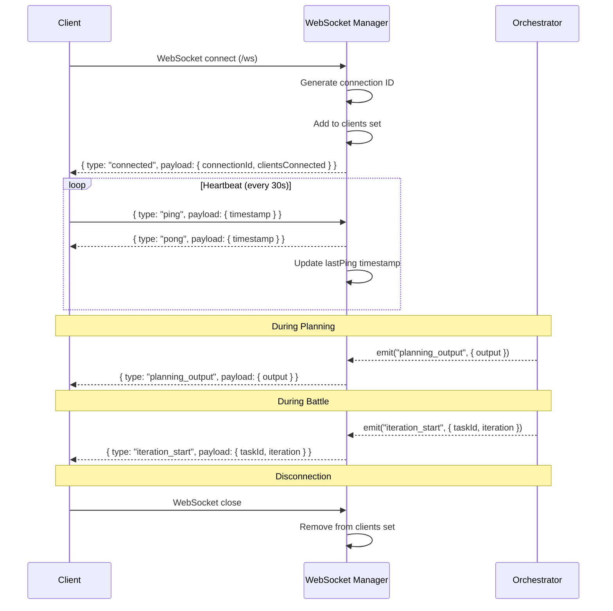

# 07 - WebSocket Specification

## Purpose

WebSocket provides real-time communication between the server and web clients. It enables live updates for planning output, battle progress, iteration events, and system notifications without polling.

## User Stories

### US-WS-1: Real-time Planning Updates
**As a** developer
**I want** to see Claude's planning output as it streams
**So that** I can follow the conversation in real-time

**Acceptance Criteria:**
- Output appears character by character
- No noticeable delay
- Questions appear immediately
- Connection survives long planning sessions

### US-WS-2: Live Battle Progress
**As a** developer
**I want** to see battle updates in real-time
**So that** I can monitor execution without refreshing

**Acceptance Criteria:**
- Iteration start/end events
- Progress updates every 2 seconds
- Feedback results as they complete
- Completion/failure notification

### US-WS-3: Connection Resilience
**As a** developer
**I want** the connection to automatically reconnect
**So that** I don't lose updates after network blips

**Acceptance Criteria:**
- Auto-reconnect on disconnect
- Backoff strategy for repeated failures
- Clear connection status indicator
- Resume from last known state

### US-WS-4: Multi-Client Support
**As a** team
**I want** multiple clients to receive the same updates
**So that** team members can monitor together

**Acceptance Criteria:**
- All clients receive all events
- New clients get current state
- Client count visible to admins
- No client-specific state on server

## Current Behavior

### Architecture

```
┌─────────────────────────────────────────────────────────────────────┐
│                          Web Clients                                │
│   ┌──────────┐  ┌──────────┐  ┌──────────┐  ┌──────────┐          │
│   │ Client 1 │  │ Client 2 │  │ Client 3 │  │ Client N │          │
│   └────┬─────┘  └────┬─────┘  └────┬─────┘  └────┬─────┘          │
│        │             │             │             │                  │
│        └─────────────┴──────┬──────┴─────────────┘                  │
│                             │ WebSocket                             │
│                             ▼                                       │
│   ┌─────────────────────────────────────────────────────────────┐  │
│   │                   WebSocket Manager                          │  │
│   │  - Maintains client connections                              │  │
│   │  - Broadcasts events to all clients                          │  │
│   │  - Handles ping/pong heartbeat                               │  │
│   └────────────────────────────┬────────────────────────────────┘  │
│                                │ Events                             │
│                                ▼                                    │
│   ┌─────────────────────────────────────────────────────────────┐  │
│   │                    Orchestrator                              │  │
│   │  - PlanService events                                        │  │
│   │  - BattleOrchestrator events                                 │  │
│   │  - ProgressWatcher events                                    │  │
│   └─────────────────────────────────────────────────────────────┘  │
└─────────────────────────────────────────────────────────────────────┘
```

### Connection Flow



### Message Format

All WebSocket messages follow this format:

```typescript
interface WebSocketMessage<T = unknown> {
  type: WebSocketEventType;
  payload: T;
  timestamp: string;  // ISO 8601
}
```

### Event Types

```typescript
type WebSocketEventType =
  // Connection
  | "connected"
  | "pong"
  // Planning events
  | "planning_output"
  | "planning_question"
  | "planning_completed"
  | "planning_keepalive"
  // Battle events
  | "battle_start"
  | "battle_pause"
  | "battle_resume"
  | "battle_cancel"
  | "battle_complete"
  | "battle_failed"
  // Iteration events
  | "iteration_start"
  | "iteration_end"
  | "iteration_output"
  // Progress events
  | "progress_update"
  | "completion_detected"
  // Feedback events
  | "feedback_result"
  // Approval events (HITL)
  | "await_approval"
  | "approval_received"
  // Repository events
  | "repo_changed"
  // System events
  | "error";
```

## Event Specification

### Connection Events

#### connected

Sent when a client connects successfully.

```typescript
interface ConnectedPayload {
  connectionId: string;      // Unique ID for this connection
  clientsConnected: number;  // Total connected clients
}
```

#### pong

Response to client ping.

```typescript
interface PongPayload {
  timestamp: string;  // Echo of client's timestamp
}
```

---

### Planning Events

#### planning_output

Streamed output from Claude during planning.

```typescript
interface PlanningOutputPayload {
  output: string;  // Chunk of text
}
```

**Frequency:** Many times per second during active planning.

#### planning_question

Claude is asking a question.

```typescript
interface PlanningQuestionPayload {
  question: string;  // Detected question text
}
```

#### planning_completed

Planning finished successfully.

```typescript
interface PlanningCompletedPayload {
  prd: PRD;  // Generated PRD
}
```

#### planning_keepalive

Periodic signal during long planning operations.

```typescript
interface PlanningKeepalivePayload {
  timestamp: string;
  state: "idle" | "planning" | "waiting_input" | "completed";
}
```

**Frequency:** Every 30 seconds during planning.

---

### Battle Events

#### battle_start

Battle has begun.

```typescript
interface BattleStartPayload {
  taskId: string;
  task: Task;
}
```

#### battle_pause

Battle paused by user.

```typescript
interface BattlePausePayload {
  taskId: string;
  iteration: number;
}
```

#### battle_resume

Battle resumed.

```typescript
interface BattleResumePayload {
  taskId: string;
}
```

#### battle_cancel

Battle cancelled.

```typescript
interface BattleCancelPayload {
  taskId: string;
  reason?: string;
}
```

#### battle_complete

Battle completed successfully.

```typescript
interface BattleCompletePayload {
  taskId: string;
  battle: Battle;
}
```

#### battle_failed

Battle failed.

```typescript
interface BattleFailedPayload {
  taskId: string;
  error: string;
  battle: Battle;
}
```

---

### Iteration Events

#### iteration_start

New iteration beginning.

```typescript
interface IterationStartPayload {
  taskId: string;
  iteration: number;
}
```

#### iteration_end

Iteration completed.

```typescript
interface IterationEndPayload {
  taskId: string;
  iteration: number;
  result: "success" | "failure" | "timeout" | "cancelled";
}
```

#### iteration_output

Claude output during iteration.

```typescript
interface IterationOutputPayload {
  taskId: string;
  iteration: number;
  output: string;  // Chunk of text
}
```

**Frequency:** Many times per second during Claude execution.

---

### Progress Events

#### progress_update

Progress file changed.

```typescript
interface ProgressUpdatePayload {
  taskId: string;
  progress: Progress;
}
```

**Frequency:** Every 2 seconds (polling interval).

#### completion_detected

Completion sigil found.

```typescript
interface CompletionDetectedPayload {
  taskId: string;
}
```

---

### Feedback Events

#### feedback_result

Feedback loop completed.

```typescript
interface FeedbackResultPayload {
  taskId: string;
  loop: string;  // "test", "lint", etc.
  result: {
    passed: boolean;
    output: string;
    duration: number;
  };
}
```

---

### Approval Events

#### await_approval

HITL mode waiting for approval.

```typescript
interface AwaitApprovalPayload {
  taskId: string;
  iteration: number;
  summary: string;  // Truncated output
}
```

#### approval_received

User approved/rejected.

```typescript
interface ApprovalReceivedPayload {
  taskId: string;
  approved: boolean;
}
```

---

### Repository Events

#### repo_changed

Active repository changed.

```typescript
interface RepoChangedPayload {
  workingDir: string;
}
```

---

### System Events

#### error

System error occurred.

```typescript
interface ErrorPayload {
  message: string;
  code?: string;
  details?: unknown;
}
```

---

## Client Implementation

### Connection Setup

```typescript
class WebSocketClient {
  private ws: WebSocket | null = null;
  private reconnectAttempts = 0;
  private maxReconnectAttempts = 10;
  private reconnectDelay = 1000;  // Start at 1 second

  connect(url: string) {
    this.ws = new WebSocket(url);

    this.ws.onopen = () => {
      this.reconnectAttempts = 0;
      this.reconnectDelay = 1000;
      this.startPingInterval();
    };

    this.ws.onmessage = (event) => {
      const message = JSON.parse(event.data);
      this.handleMessage(message);
    };

    this.ws.onclose = () => {
      this.stopPingInterval();
      this.scheduleReconnect();
    };

    this.ws.onerror = (error) => {
      console.error('WebSocket error:', error);
    };
  }

  private scheduleReconnect() {
    if (this.reconnectAttempts >= this.maxReconnectAttempts) {
      this.emit('connection_failed');
      return;
    }

    setTimeout(() => {
      this.reconnectAttempts++;
      this.reconnectDelay = Math.min(this.reconnectDelay * 2, 30000);
      this.connect(this.url);
    }, this.reconnectDelay);
  }

  private startPingInterval() {
    this.pingInterval = setInterval(() => {
      this.send({ type: 'ping', payload: { timestamp: new Date().toISOString() } });
    }, 25000);  // Every 25 seconds (server timeout is 600s)
  }
}
```

### Event Handling

```typescript
// React hook example
function useWebSocket() {
  const [connected, setConnected] = useState(false);
  const [events, setEvents] = useState<WebSocketMessage[]>([]);

  useEffect(() => {
    const client = new WebSocketClient();

    client.on('connected', () => setConnected(true));
    client.on('disconnected', () => setConnected(false));

    client.on('planning_output', (payload) => {
      // Append to output buffer
    });

    client.on('battle_start', (payload) => {
      // Update battle state
    });

    client.connect('ws://localhost:3456/ws');

    return () => client.disconnect();
  }, []);

  return { connected, events };
}
```

---

## Server Implementation

### WebSocket Manager

```typescript
class WebSocketManager {
  private clients = new Set<ServerWebSocket>();
  private heartbeatInterval: Timer | null = null;
  private heartbeatIntervalMs = 30000;      // 30 seconds
  private connectionTimeoutMs = 600000;     // 10 minutes

  handleOpen(ws: ServerWebSocket) {
    ws.data = {
      id: generateConnectionId(),
      lastPing: Date.now(),
      isAlive: true,
    };

    this.clients.add(ws);
    this.send(ws, 'connected', {
      connectionId: ws.data.id,
      clientsConnected: this.clients.size,
    });
  }

  handleMessage(ws: ServerWebSocket, data: string) {
    const message = JSON.parse(data);

    if (message.type === 'ping') {
      ws.data.lastPing = Date.now();
      ws.data.isAlive = true;
      this.send(ws, 'pong', { timestamp: message.payload.timestamp });
    }
  }

  broadcast<T>(type: WebSocketEventType, payload: T) {
    const message = {
      type,
      payload,
      timestamp: new Date().toISOString(),
    };

    for (const client of this.clients) {
      try {
        client.send(JSON.stringify(message));
      } catch {
        this.clients.delete(client);
      }
    }
  }

  private startHeartbeat() {
    this.heartbeatInterval = setInterval(() => {
      const now = Date.now();

      for (const client of this.clients) {
        if (now - client.data.lastPing > this.connectionTimeoutMs) {
          client.close(1000, 'Connection timeout');
          this.clients.delete(client);
        }
      }
    }, this.heartbeatIntervalMs);
  }
}
```

---

## Error Handling

### Connection Errors

| Error | Cause | Client Handling |
|-------|-------|-----------------|
| Connection refused | Server down | Show offline state, retry |
| Handshake failed | Protocol error | Log error, retry with backoff |
| Network timeout | Slow network | Retry with exponential backoff |

### Message Errors

| Error | Cause | Handling |
|-------|-------|----------|
| Invalid JSON | Malformed message | Log and ignore |
| Unknown type | Unsupported event | Log and ignore |
| Missing payload | Incomplete message | Log and ignore |

### Heartbeat Errors

| Error | Cause | Server Handling |
|-------|-------|-----------------|
| No ping received | Client frozen | Close after timeout |
| Pong not received | Network issue | Client will reconnect |

---

## Edge Cases

### Timeout Mismatch

**Problem:** Server timeout (600s) vs keepalive interval (30s) creates large gap.

**Current Behavior:**
- Server checks for dead connections every 30 seconds
- Client considered dead if no ping for 600 seconds
- 20 missed pings before disconnect

**Proposed Improvement:**
- Reduce timeout to 120 seconds (4 missed pings)
- Add configurable timeout
- Send server-side ping if no client ping

---

### Message Ordering

**Problem:** Messages may arrive out of order on unreliable networks.

**Current Behavior:** No sequence numbers, assume in-order.

**Proposed Improvement:**
- Add sequence numbers to messages
- Buffer and reorder on client
- Request missed messages

---

### Reconnection Data Loss

**Problem:** Events during reconnection are lost.

**Current Behavior:** Client reconnects, no state sync.

**Proposed Improvement:**
- Server maintains recent event buffer
- Client requests missed events on reconnect
- Include sequence number in connected payload

---

### Large Message Handling

**Problem:** Very large iteration outputs may exceed message limits.

**Current Behavior:** Full output sent in single message.

**Proposed Improvement:**
- Chunk large messages
- Set configurable max message size
- Compress large payloads

---

### Multiple Tabs

**Problem:** User opens multiple tabs, each connects separately.

**Current Behavior:** Each tab is independent client.

**Proposed Improvement:**
- Use SharedWorker for single connection
- Broadcast to all tabs locally
- Reduce server load

---

## Testing Requirements

### Unit Tests
- [ ] Message serialization/deserialization
- [ ] Event type handling
- [ ] Heartbeat timing
- [ ] Client set management

### Integration Tests
- [ ] Connect and receive events
- [ ] Ping/pong heartbeat
- [ ] Reconnection after disconnect
- [ ] Broadcast to multiple clients

### E2E Tests
- [ ] Real-time planning output
- [ ] Battle progress updates
- [ ] Connection status indicator
- [ ] Survive network interruption

---

## Performance Considerations

### Message Throughput
- Planning output: ~10-50 messages/second
- Battle output: ~10-50 messages/second
- Progress updates: 1 message/2 seconds

**Mitigation:**
- Batch rapid messages
- Throttle on server
- Debounce on client

### Memory Usage
- Each client: ~1KB
- Message buffer: Configurable
- Event history: None (stateless)

**Mitigation:**
- Limit connected clients
- Clear stale connections
- No message persistence

### CPU Usage
- JSON serialization for each broadcast
- Heartbeat checks every 30 seconds

**Mitigation:**
- Batch broadcasts
- Use efficient serialization
- Lazy heartbeat check

---

## Security Considerations

### Authentication
- Currently: None (open WebSocket)
- Future: Token-based authentication

### Authorization
- All clients receive all events
- No client-specific filtering

### Data Exposure
- Task content visible to all clients
- Claude output visible to all clients

---

## Reconnection Strategy (Reliability Enhancement)

### Problem

When a client disconnects and reconnects, it misses events that occurred during the disconnection period. This can leave the UI in an inconsistent state.

### Reconnect with State Resync

**Purpose:** Ensure clients have accurate state after reconnection.

**Resync Protocol:**
```typescript
interface ResyncRequest {
  type: "resync";
  lastEventId?: string;          // Last event ID client received
  lastEventTimestamp?: string;   // Fallback if no event ID
  requestedScopes: ResyncScope[];
}

type ResyncScope = "battle" | "planning" | "config" | "prd" | "all";

interface ResyncResponse {
  type: "resync_response";
  connectionId: string;
  serverTimestamp: string;
  state: ServerState;
  missedEvents: WebSocketMessage[];  // Events since lastEventId
  truncated: boolean;                 // If too many events, snapshot used instead
}

interface ServerState {
  activeBattle?: {
    taskId: string;
    status: BattleStatus;
    iteration: number;
    progress: Progress;
  };
  planningSession?: {
    state: PlanningState;
    partialOutput: string;
  };
  config: Config;
  prd?: PRD;
}
```

**Client Resync Flow:**
```typescript
class ReconnectingWebSocketClient {
  private lastEventId: string | null = null;
  private reconnectAttempts = 0;

  async connect(url: string) {
    this.ws = new WebSocket(url);

    this.ws.onopen = async () => {
      // Request resync on reconnection
      if (this.lastEventId || this.reconnectAttempts > 0) {
        await this.requestResync();
      }
      this.reconnectAttempts = 0;
    };

    this.ws.onmessage = (event) => {
      const message = JSON.parse(event.data) as WebSocketMessage;

      // Track event ID for resync
      if (message.eventId) {
        this.lastEventId = message.eventId;
      }

      if (message.type === "resync_response") {
        this.handleResyncResponse(message.payload);
      } else {
        this.handleMessage(message);
      }
    };

    this.ws.onclose = () => {
      this.scheduleReconnect();
    };
  }

  private async requestResync() {
    this.send({
      type: "resync",
      lastEventId: this.lastEventId,
      requestedScopes: ["all"],
    });
  }

  private handleResyncResponse(response: ResyncResponse) {
    // 1. Apply full state snapshot
    this.applyStateSnapshot(response.state);

    // 2. Replay missed events in order
    if (!response.truncated) {
      for (const event of response.missedEvents) {
        this.handleMessage(event);
      }
    }

    // 3. Emit resync complete
    this.emit("resync_complete", response);
  }
}
```

**Server Resync Handler:**
```typescript
class WebSocketManager {
  private eventBuffer: CircularBuffer<WebSocketMessage>;
  private maxBufferSize = 1000;

  handleResyncRequest(ws: ServerWebSocket, request: ResyncRequest) {
    const state = this.getCurrentState(request.requestedScopes);
    const missedEvents = this.getMissedEvents(request.lastEventId);

    const response: ResyncResponse = {
      type: "resync_response",
      connectionId: ws.data.id,
      serverTimestamp: new Date().toISOString(),
      state,
      missedEvents: missedEvents.slice(0, 100),  // Limit to prevent huge payloads
      truncated: missedEvents.length > 100,
    };

    this.send(ws, "resync_response", response);
  }

  private getCurrentState(scopes: ResyncScope[]): ServerState {
    const state: ServerState = {
      config: this.configService.getConfig(),
    };

    if (scopes.includes("battle") || scopes.includes("all")) {
      const activeBattle = this.battleService.getActiveBattle();
      if (activeBattle) {
        state.activeBattle = {
          taskId: activeBattle.taskId,
          status: activeBattle.status,
          iteration: activeBattle.currentIteration,
          progress: activeBattle.progress,
        };
      }
    }

    if (scopes.includes("planning") || scopes.includes("all")) {
      const planningSession = this.planService.getCurrentSession();
      if (planningSession) {
        state.planningSession = {
          state: planningSession.state,
          partialOutput: planningSession.output,
        };
      }
    }

    if (scopes.includes("prd") || scopes.includes("all")) {
      state.prd = this.prdService.getPRD();
    }

    return state;
  }

  private getMissedEvents(lastEventId: string | undefined): WebSocketMessage[] {
    if (!lastEventId) {
      return [];  // No reference point, use state snapshot only
    }

    const events: WebSocketMessage[] = [];
    let found = false;

    for (const event of this.eventBuffer) {
      if (found) {
        events.push(event);
      } else if (event.eventId === lastEventId) {
        found = true;
      }
    }

    return events;
  }
}
```

---

### Snapshot Strategy

**Purpose:** Efficiently catch up clients that missed too many events.

**When to Use Snapshots:**
- Client was disconnected for extended period
- Event buffer overflowed (> maxBufferSize)
- Client requests "all" scope resync
- First connection (no lastEventId)

**Snapshot vs Event Replay:**
| Scenario | Strategy | Reason |
|----------|----------|--------|
| < 50 missed events | Replay events | Preserves event ordering, minimal overhead |
| 50-100 missed events | Replay events + warn | Still manageable, warn about potential inconsistency |
| > 100 missed events | Snapshot only | Event replay would be slow and potentially inconsistent |
| Unknown lastEventId | Snapshot only | No reliable starting point |
| Buffer overflow | Snapshot only | Events lost, can't replay |

**Snapshot Data Structure:**
```typescript
interface StateSnapshot {
  version: number;           // Schema version
  timestamp: string;         // When snapshot was taken
  checksum: string;          // For verification

  // Core state
  config: Config;
  prd: PRD | null;

  // Battle state
  battle: {
    taskId: string;
    status: BattleStatus;
    iteration: number;
    progress: Progress;
    feedbackResults: FeedbackResults;
  } | null;

  // Planning state
  planning: {
    state: PlanningState;
    output: string;
    questions: Question[];
  } | null;

  // Metadata
  clients: {
    count: number;
    ids: string[];
  };
}
```

**Snapshot Creation:**
```typescript
function createSnapshot(): StateSnapshot {
  return {
    version: 1,
    timestamp: new Date().toISOString(),
    checksum: computeStateChecksum(),

    config: configService.getConfig(),
    prd: prdService.getPRD(),

    battle: battleService.getActiveBattle()
      ? {
          taskId: battleService.getActiveBattle()!.taskId,
          status: battleService.getActiveBattle()!.status,
          iteration: battleService.getActiveBattle()!.currentIteration,
          progress: battleService.getActiveBattle()!.progress,
          feedbackResults: battleService.getActiveBattle()!.feedbackResults,
        }
      : null,

    planning: planService.getCurrentSession()
      ? {
          state: planService.getCurrentSession()!.state,
          output: planService.getCurrentSession()!.output,
          questions: planService.getCurrentSession()!.questions,
        }
      : null,

    clients: {
      count: wsManager.getClientCount(),
      ids: wsManager.getClientIds(),
    },
  };
}
```

---

### Enhanced Message Format

**Add Event IDs and Sequence Numbers:**
```typescript
interface WebSocketMessage<T = unknown> {
  type: WebSocketEventType;
  payload: T;
  timestamp: string;        // ISO 8601

  // New fields for resync support
  eventId: string;          // Unique event identifier (UUID)
  sequence: number;         // Monotonically increasing sequence number
  scope: ResyncScope;       // Which state this affects
}
```

**Event Buffer Implementation:**
```typescript
class CircularBuffer<T> {
  private buffer: T[];
  private head = 0;
  private tail = 0;
  private size = 0;

  constructor(private capacity: number) {
    this.buffer = new Array(capacity);
  }

  push(item: T): void {
    this.buffer[this.tail] = item;
    this.tail = (this.tail + 1) % this.capacity;

    if (this.size < this.capacity) {
      this.size++;
    } else {
      // Overwrite oldest
      this.head = (this.head + 1) % this.capacity;
    }
  }

  *[Symbol.iterator](): Iterator<T> {
    for (let i = 0; i < this.size; i++) {
      yield this.buffer[(this.head + i) % this.capacity];
    }
  }

  findIndex(predicate: (item: T) => boolean): number {
    for (let i = 0; i < this.size; i++) {
      if (predicate(this.buffer[(this.head + i) % this.capacity])) {
        return i;
      }
    }
    return -1;
  }
}
```

---

### Reconnection UI Feedback

```
┌──────────────────────────────────────────────────────────────────┐
│ ⚡ Reconnecting...                                                │
│ ────────────────────────────────────────────────────────────────│
│                                                                  │
│ Connection lost. Attempting to reconnect (attempt 2/10)...      │
│                                                                  │
│ [████████░░░░░░░░░░░░] Resync in progress                       │
│                                                                  │
│ ✓ Config loaded                                                  │
│ ✓ PRD loaded                                                     │
│ ● Battle state syncing...                                        │
│ ○ Planning state pending                                         │
│                                                                  │
└──────────────────────────────────────────────────────────────────┘
```

**Reconnection States:**
| State | Visual | Description |
|-------|--------|-------------|
| `connecting` | Spinner | Initial connection attempt |
| `connected` | Green dot | Connected and synced |
| `reconnecting` | Yellow spinner | Attempting reconnection |
| `resyncing` | Progress bar | Syncing state after reconnect |
| `offline` | Red X | Failed after max attempts |

**Connection Status Component:**
```typescript
interface ConnectionStatus {
  state: "connected" | "connecting" | "reconnecting" | "resyncing" | "offline";
  lastConnected: string | null;
  reconnectAttempt: number;
  maxAttempts: number;
  nextAttemptIn: number | null;  // Seconds
  resyncProgress: {
    total: number;
    completed: number;
    currentScope: string;
  } | null;
}
```

---

## Open Questions

1. **Should we support message acknowledgment?** Ensure delivery.
2. **Should we support client subscriptions?** Filter events per client.
3. **Should we add authentication?** Secure the WebSocket.
4. **Should we persist event history?** Allow clients to catch up. *(Addressed with buffer above)*
5. **Should snapshots be compressed?** Reduce bandwidth for large state.
6. **Should we support differential sync?** Send only changed fields.
