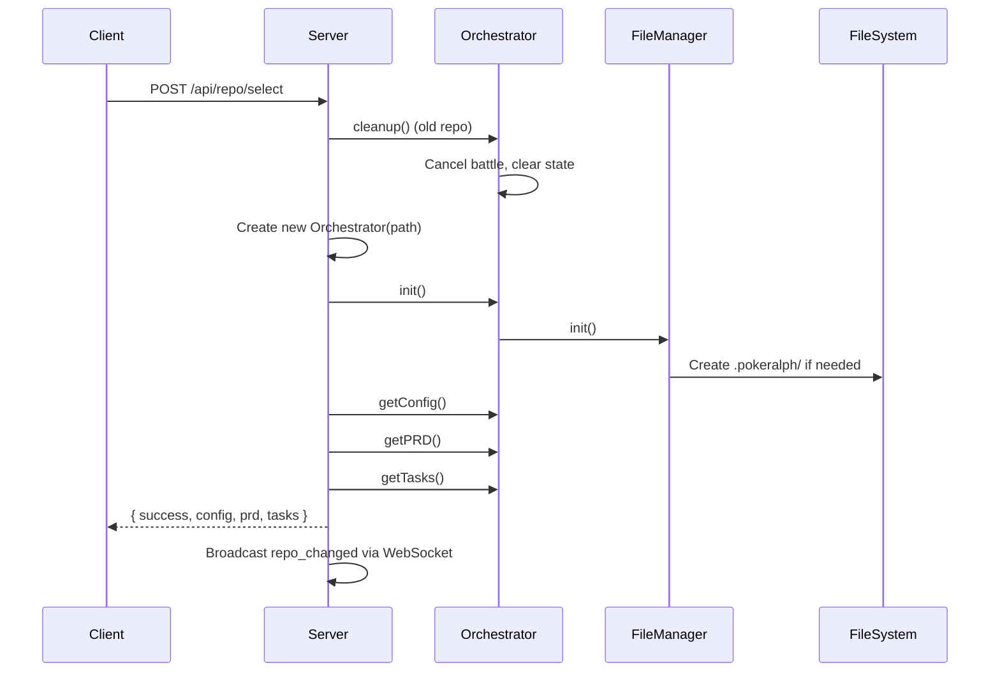
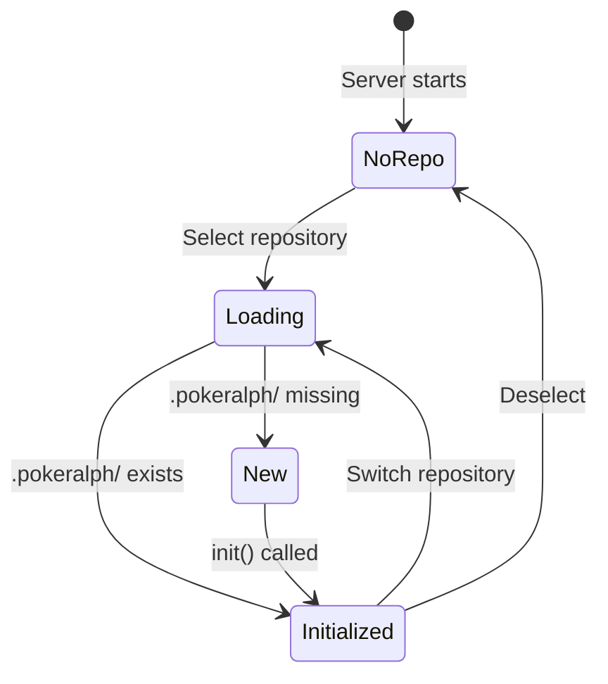

# 08 - Repository Management Specification

## Purpose

Repository management handles selecting which project PokéRalph operates on. Each repository has its own `.pokeralph/` folder containing configuration, PRD, and battle data. The server maintains a single active repository at a time.

## User Stories

### US-RP-1: Select Repository
**As a** developer
**I want** to select which repository to work on
**So that** I can manage multiple projects

**Acceptance Criteria:**
- Browse/select local folders
- Validate folder is git repository
- Remember recently used repositories
- Clear feedback on selection

### US-RP-2: Initialize Repository
**As a** developer
**I want** PokéRalph to set up in a new repository
**So that** I can start using it immediately

**Acceptance Criteria:**
- Create `.pokeralph/` folder
- Initialize default config
- Add to .gitignore (optional)
- No destructive changes

### US-RP-3: Switch Repositories
**As a** developer
**I want** to switch between repositories
**So that** I can work on different projects

**Acceptance Criteria:**
- Cancel any running battle
- Cleanup old state
- Load new repository data
- Notify all clients

### US-RP-4: Detect Repository State
**As a** developer
**I want** to see the state of the selected repository
**So that** I know if it's initialized

**Acceptance Criteria:**
- Show if `.pokeralph/` exists
- Show if PRD exists
- Show task count
- Show active battle status

## Current Behavior

### Data Flow



### Folder Structure

```
/path/to/repo/
├── .git/                    # Git repository (required)
├── .gitignore               # Should include .pokeralph/
├── .pokeralph/              # PokéRalph data folder
│   ├── config.json          # Project configuration
│   ├── prd.json             # PRD with tasks
│   └── battles/             # Battle data
│       └── {task-id}/
│           ├── progress.json
│           ├── history.json
│           └── logs/
├── src/                     # Project source code
├── tests/                   # Project tests
└── package.json             # Project manifest
```

### State Management



## API Specification

### POST /api/repo/select

Select and initialize a repository.

**Request:**
```typescript
interface SelectRepoRequest {
  path: string;  // Absolute path to repository
}
```

**Response:**
```typescript
interface SelectRepoResponse {
  success: boolean;
  workingDir: string;
  initialized: boolean;  // Was .pokeralph/ already present
  config: Config;
  prd: PRD | null;
  taskCount: number;
  hasActiveBattle: boolean;
}
```

**Errors:**
| Status | Code | Description |
|--------|------|-------------|
| 400 | `INVALID_PATH` | Path doesn't exist |
| 400 | `NOT_A_DIRECTORY` | Path is not a directory |
| 400 | `NOT_A_GIT_REPO` | No .git folder found |
| 500 | `INIT_FAILED` | Failed to initialize |

---

### GET /api/repo/current

Get current repository info.

**Response:**
```typescript
interface CurrentRepoResponse {
  workingDir: string | null;
  initialized: boolean;
  config: Config | null;
  prd: PRD | null;
  taskCount: number;
  hasActiveBattle: boolean;
}
```

---

### POST /api/repo/init

Initialize `.pokeralph/` in current repository.

**Response:**
```typescript
interface InitRepoResponse {
  success: boolean;
  message: string;
}
```

**Errors:**
| Status | Code | Description |
|--------|------|-------------|
| 400 | `NO_REPO_SELECTED` | No repository selected |
| 409 | `ALREADY_INITIALIZED` | .pokeralph/ already exists |

---

### GET /api/repo/validate

Validate a path as a potential repository.

**Query Parameters:**
- `path`: Absolute path to validate

**Response:**
```typescript
interface ValidateRepoResponse {
  valid: boolean;
  exists: boolean;
  isDirectory: boolean;
  isGitRepo: boolean;
  hasPokeralph: boolean;
  errors: string[];
}
```

---

### GET /api/repo/recent

Get recently used repositories.

**Response:**
```typescript
interface RecentReposResponse {
  repos: {
    path: string;
    name: string;
    lastUsed: string;  // ISO timestamp
    taskCount: number;
  }[];
}
```

---

### DELETE /api/repo/recent/{path}

Remove a repository from recent list.

**Response:**
```typescript
interface RemoveRecentResponse {
  success: boolean;
}
```

---

## UI Requirements

### Repository Selection View

```
┌────────────────────────────────────────────────────────────────────┐
│  Select Repository                                                 │
│  ═══════════════════════════════════════════════════════════════  │
├────────────────────────────────────────────────────────────────────┤
│                                                                    │
│  Recent Repositories                                              │
│  ────────────────────────────────────────────────────────────────  │
│                                                                    │
│  ┌──────────────────────────────────────────────────────────────┐ │
│  │ 📁 pokeralph                                      [Select]   │ │
│  │    /Users/dev/projects/pokeralph                             │ │
│  │    Last used: 2 hours ago | 8 tasks                          │ │
│  └──────────────────────────────────────────────────────────────┘ │
│                                                                    │
│  ┌──────────────────────────────────────────────────────────────┐ │
│  │ 📁 my-app                                         [Select]   │ │
│  │    /Users/dev/projects/my-app                                │ │
│  │    Last used: 3 days ago | 12 tasks                          │ │
│  └──────────────────────────────────────────────────────────────┘ │
│                                                                    │
│  ────────────────────────────────────────────────────────────────  │
│                                                                    │
│  Or select a new repository:                                      │
│                                                                    │
│  Path: [/Users/dev/projects/new-proj_____] [Browse...]           │
│                                                                    │
│  ┌──────────────────────────────────────────────────────────────┐ │
│  │ Validation:                                                   │ │
│  │ ✅ Directory exists                                          │ │
│  │ ✅ Is a git repository                                       │ │
│  │ ⚠️ No .pokeralph/ folder (will be created)                   │ │
│  └──────────────────────────────────────────────────────────────┘ │
│                                                                    │
│                                              [Select Repository]  │
└────────────────────────────────────────────────────────────────────┘
```

### Repository Status Bar

```
┌────────────────────────────────────────────────────────────────────┐
│ 📁 pokeralph | /Users/dev/projects/pokeralph | [Switch Repo]      │
└────────────────────────────────────────────────────────────────────┘
```

### No Repository State

```
┌────────────────────────────────────────────────────────────────────┐
│                                                                    │
│                    📂 No Repository Selected                       │
│                                                                    │
│  Select a repository to get started with PokéRalph.               │
│                                                                    │
│                     [Select Repository →]                          │
│                                                                    │
└────────────────────────────────────────────────────────────────────┘
```

### Initialization Dialog

```
┌────────────────────────────────────────────────────────────────────┐
│  Initialize PokéRalph                                    [X Close] │
├────────────────────────────────────────────────────────────────────┤
│                                                                    │
│  This repository doesn't have a .pokeralph/ folder yet.           │
│                                                                    │
│  PokéRalph will create:                                           │
│  • .pokeralph/config.json (default configuration)                 │
│                                                                    │
│  [ ] Add .pokeralph/ to .gitignore                                │
│      (Recommended: keeps battle data local)                       │
│                                                                    │
├────────────────────────────────────────────────────────────────────┤
│                                [Cancel]    [Initialize]           │
└────────────────────────────────────────────────────────────────────┘
```

---

## Component States

### Repository Card

| State | Visual |
|-------|--------|
| `idle` | Normal card |
| `hover` | Elevated |
| `selected` | Accent border |
| `loading` | Spinner overlay |
| `error` | Error state |

### Path Input

| State | Visual |
|-------|--------|
| `empty` | Placeholder text |
| `typing` | Normal input |
| `validating` | Spinner |
| `valid` | Green checkmark |
| `invalid` | Red error text |

### Select Button

| State | Visual |
|-------|--------|
| `disabled` | Grayed out |
| `enabled` | Primary color |
| `loading` | Spinner |
| `error` | Error color |

---

## Validation Rules

### Path Validation

| Check | Requirement | Error Message |
|-------|-------------|---------------|
| Exists | Path must exist | "Path does not exist" |
| Directory | Must be a directory | "Path is not a directory" |
| Readable | Must have read permission | "Cannot read directory" |
| Git repo | Must contain `.git/` | "Not a git repository" |

### Repository Validation

| Check | Requirement | Warning/Error |
|-------|-------------|---------------|
| `.pokeralph/` | Should exist | Warning: "Will be created" |
| `config.json` | Should be valid | Error if corrupt |
| `prd.json` | Optional | Info: "No PRD yet" |

---

## Error Handling

### Selection Errors

| Error | Cause | User Message | Recovery |
|-------|-------|--------------|----------|
| Path not found | Invalid path | "Directory not found" | Fix path |
| Permission denied | No read access | "Cannot access directory" | Fix permissions |
| Not git repo | No .git folder | "Not a git repository" | Use git init |

### Initialization Errors

| Error | Cause | User Message | Recovery |
|-------|-------|--------------|----------|
| Write failed | No write permission | "Cannot create .pokeralph" | Fix permissions |
| Already exists | Double init | "Already initialized" | Skip init |
| Disk full | No space | "Insufficient disk space" | Free space |

### Switch Errors

| Error | Cause | User Message | Recovery |
|-------|-------|--------------|----------|
| Battle running | Active battle | "Cancel battle first?" | Cancel or wait |
| Cleanup failed | Old state error | "Error cleaning up" | Force switch |

---

## Edge Cases

### Battle During Switch

**Problem:** User switches repo while battle is running.

**Current Behavior:**
- Battle is cancelled with reason "Repository switch - cleanup"
- State is cleared

**Proposed Improvement:**
- Confirm dialog before switch
- Option to pause instead of cancel
- Save battle state for resume

---

### Corrupted Repository Data

**Problem:** `.pokeralph/` exists but data is corrupt.

**Current Behavior:** Errors on load, unusable.

**Proposed Improvement:**
- Detect corruption on load
- Offer to reset to defaults
- Backup existing data before reset

---

### Repository Moved/Renamed

**Problem:** Recent repo path no longer exists.

**Current Behavior:** Error when selecting from recent.

**Proposed Improvement:**
- Validate recent repos on load
- Mark unavailable repos
- Auto-remove after X days

---

### Concurrent Server Instances

**Problem:** Multiple server instances could have different repos.

**Current Behavior:** Not supported, would conflict.

**Proposed Improvement:**
- Lock file in .pokeralph/
- Detect conflicting instances
- Clear error message

---

### Large Repository

**Problem:** Repo with thousands of files may be slow.

**Current Behavior:** No special handling.

**Proposed Improvement:**
- Only scan .pokeralph/ folder
- Lazy load PRD and config
- Progress indicator for large repos

---

## Testing Requirements

### Unit Tests
- [ ] Path validation catches all errors
- [ ] Init creates correct folder structure
- [ ] Switch cleans up old state
- [ ] Recent repos stored correctly

### Integration Tests
- [ ] Select repo loads config and PRD
- [ ] Switch triggers WebSocket event
- [ ] Init creates default config
- [ ] Validation checks all requirements

### E2E Tests
- [ ] Select from recent repos
- [ ] Browse and select new repo
- [ ] Initialize new repository
- [ ] Switch between repos
- [ ] Handle invalid paths

---

## Performance Considerations

### Repository Loading
- Minimal I/O on select
- Lazy load battle history
- Cache recent repos list

### Switching
- Cancel battle quickly
- Clear memory immediately
- Async cleanup

### Validation
- Check existence first (fast)
- Check git repo second (fast)
- Skip full content scan

---

## Security Considerations

### Path Traversal
- Validate path is absolute
- Reject paths with `..`
- Validate path exists

### Arbitrary File Access
- Only access .pokeralph/ folder
- Validate file types before read
- No execution of repo files

### Sensitive Data
- Don't expose full paths to clients (future)
- Sanitize error messages
- Avoid logging credentials

---

## gitignore Recommendations

```gitignore
# PokéRalph battle data (keep local)
.pokeralph/battles/
.pokeralph/logs/

# Or ignore everything (no shared config)
.pokeralph/

# Alternative: share PRD only
.pokeralph/config.json
.pokeralph/battles/
```

---

## Open Questions

1. **Should we support remote repositories?** Clone from URL.
2. **Should we support workspace/monorepo?** Multiple .pokeralph folders.
3. **Should we sync PRD across team?** Share via git.
4. **Should we support repository templates?** Pre-configured setups.
